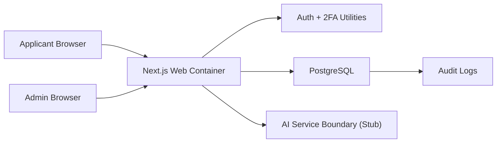
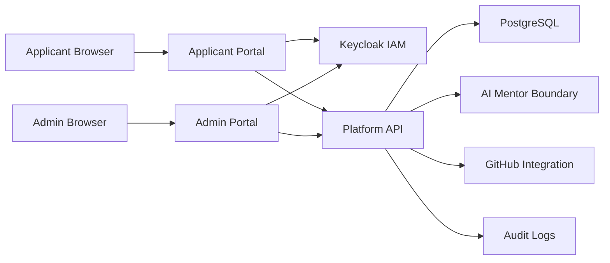
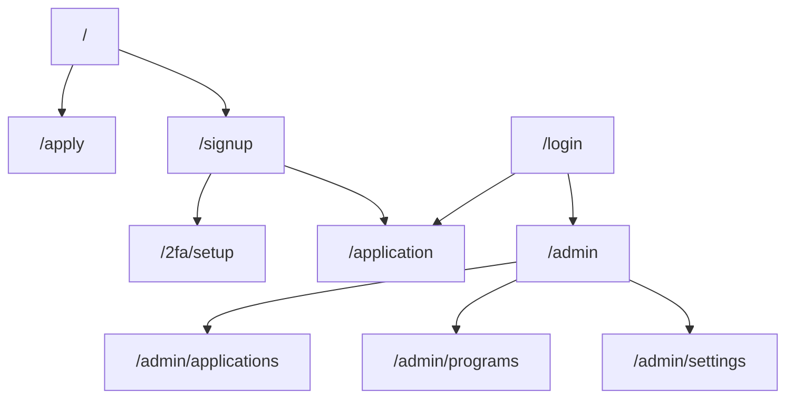

# TalentOS Architecture

Code version: `v0.1.2`

Architecture baseline commit: `4e2390ce270ef1e049652495885d792a0cbed959`

Current documentation update: `v0.1.2`

## Overview

TalentOS is a Dockerized, multi-tenant, white-label SaaS platform for talent discovery, mission-based learning and recruitment.

The first implementation creates two portals:

- Public Applicant Portal for landing pages, signup, 2FA setup and applications.
- Program Admin Portal for tenant owners/admins to review applications, manage programs and inspect audit activity.

In `v0.1.1`, these portal shells are implemented as route groups inside one Next.js app. The target architecture is to split them into two separately deployable portals.

The architecture follows the SSDLC principle that every iteration updates architecture, data model, deployment and testing documentation.

## Technology Stack

- Next.js with TypeScript for the web application and server routes.
- PostgreSQL for primary data storage.
- Prisma for database schema, migrations and typed data access.
- Tailwind CSS for maintainable UI foundations.
- Docker Compose for local and VPS deployment.
- TOTP-compatible 2FA for applicant/admin authentication.

## Runtime Components

## Target Runtime Components

The future target architecture separates applicant and admin portal concerns while sharing platform services.

## Portal Layout

## Portal Separation Direction

The current `v0.1.1` implementation is a scaffold where applicant and admin routes are served from one Next.js app.

The engineering target is:

- Separate Applicant Portal for public landing, signup, application, learning missions and portfolio experience.
- Separate Admin Portal for tenant owner/admin operations, program management, application review, mission configuration, knowledge base management and hiring recommendations.
- Shared platform services for IAM, database access, audit logging, AI, GitHub integration and certificates.
- Independent deployment path for each portal so scaling, security policy and release cadence can diverge when needed.

## Multi-Tenancy

TalentOS uses a shared PostgreSQL database with tenant-scoped records.

- Tenants are resolved from subdomains such as `demo.talentos.app`.
- Local development supports tenant simulation with hosts such as `demo.localhost`.
- Tenant-owned entities include `tenantId`.
- Application code must enforce tenant isolation before reading or mutating tenant-owned data.

## Security Model

- Passwords are hashed before storage.
- Applicants and admins are guided toward authenticator-app TOTP setup.
- Keycloak is the target IAM system for authentication, identity federation, MFA policy and role/session management.
- Admin access is limited to `OWNER` and `ADMIN` tenant roles.
- Cross-tenant access is rejected by shared authorization utilities.
- Sensitive actions are recorded in `AuditLog`.
- AI workflow boundaries are explicit so future AI mentor activity can be audited.

## Scalability

The web application is stateless and can run multiple containers behind a reverse proxy.

For 1,000 simultaneous applicants, the first scaling path is:

- multiple web containers,
- PostgreSQL indexes and connection pooling,
- background workers for long-running AI, email and GitHub jobs,
- caching for public tenant/program content.

## Deployment

The first deployment target is Docker Compose on a VPS with:

- `web` service running the Next.js application,
- `postgres` service running PostgreSQL,
- future `worker` service for background processing.

## Software Design Notes

The first iteration establishes architectural seams rather than all final behavior:

- `packages/auth` contains reusable security, tenant and workflow utilities.
- `packages/db` owns Prisma schema and database access.
- `apps/web` owns portal routes, UI, middleware and API endpoints.
- AI mentor integration is represented by a stubbed service boundary.

## Engineering To-Do List

The engineering backlog below maps the Product Backlog into near-term deliverables.

### Platform Foundation

1. IAM with Keycloak
   - Replace scaffolded custom auth direction with Keycloak as the target IAM.
   - Support tenant-aware roles for `OWNER`, `ADMIN` and `APPLICANT`.
   - Preserve MFA/2FA learning objective through Keycloak-backed authenticator-app setup.

2. Separate Applicant Portal and Admin Portal
   - Split the current single-app route scaffold into two portal surfaces.
   - Applicant Portal owns public application and participant-facing workflows.
   - Admin Portal owns tenant operations, application review and program management.

### MVP Product Modules

3. Applications
   - Persist applicant signup, application draft, submission and review workflows.

4. Programs
   - Allow tenant admins to configure programs, cohorts and public application entry points.

5. Missions
   - Implement mission lifecycle aligned to the Spiral Engineering Method.

6. AI Mentor Boundary
   - Expand the current AI service boundary into tenant-aware, auditable mentor workflows.

7. Knowledge Base
   - Add tenant-owned knowledge documents for AI assistance and program support.

8. GitHub Integration
   - Connect participant repositories and collect project evidence.

9. Portfolio
   - Generate participant-facing public portfolio artifacts.

10. Certificates
    - Support tenant-branded certificate creation and issuance.

11. Leaderboard
    - Add transparent progress and achievement visibility.

12. Hiring Recommendations
    - Produce admin-facing candidate readiness and hiring signals.
