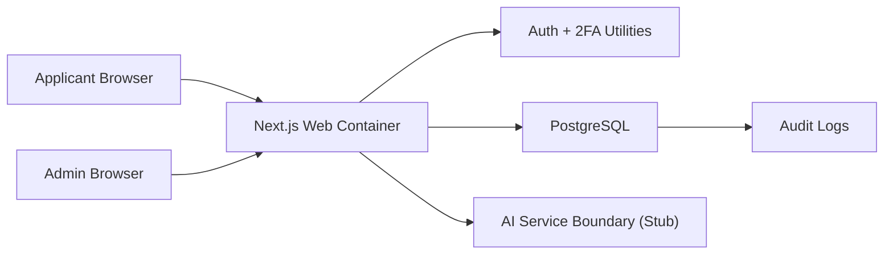
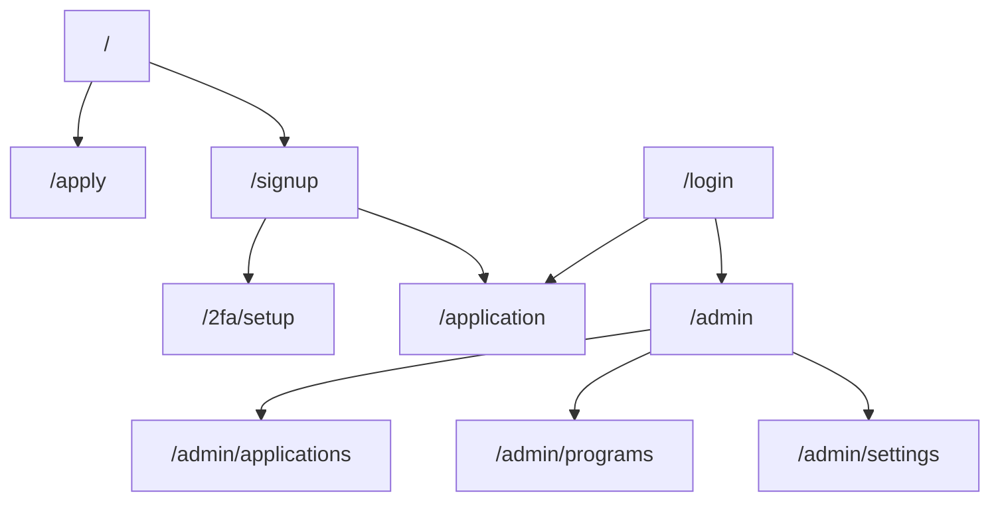

# TalentOS Architecture

## Overview

TalentOS is a Dockerized, multi-tenant, white-label SaaS platform for talent discovery, mission-based learning and recruitment.

The first implementation creates two portals:

- Public Applicant Portal for landing pages, signup, 2FA setup and applications.
- Program Admin Portal for tenant owners/admins to review applications, manage programs and inspect audit activity.

The architecture follows the SSDLC principle that every iteration updates architecture, data model, deployment and testing documentation.

## Technology Stack

- Next.js with TypeScript for the web application and server routes.
- PostgreSQL for primary data storage.
- Prisma for database schema, migrations and typed data access.
- Tailwind CSS for maintainable UI foundations.
- Docker Compose for local and VPS deployment.
- TOTP-compatible 2FA for applicant/admin authentication.

## Runtime Components

## Portal Layout

## Multi-Tenancy

TalentOS uses a shared PostgreSQL database with tenant-scoped records.

- Tenants are resolved from subdomains such as `demo.talentos.app`.
- Local development supports tenant simulation with hosts such as `demo.localhost`.
- Tenant-owned entities include `tenantId`.
- Application code must enforce tenant isolation before reading or mutating tenant-owned data.

## Security Model

- Passwords are hashed before storage.
- Applicants and admins are guided toward authenticator-app TOTP setup.
- Admin access is limited to `OWNER` and `ADMIN` tenant roles.
- Cross-tenant access is rejected by shared authorization utilities.
- Sensitive actions are recorded in `AuditLog`.
- AI workflow boundaries are explicit so future AI mentor activity can be audited.

## Scalability

The web application is stateless and can run multiple containers behind a reverse proxy.

For 1,000 simultaneous applicants, the first scaling path is:

- multiple web containers,
- PostgreSQL indexes and connection pooling,
- background workers for long-running AI, email and GitHub jobs,
- caching for public tenant/program content.

## Deployment

The first deployment target is Docker Compose on a VPS with:

- `web` service running the Next.js application,
- `postgres` service running PostgreSQL,
- future `worker` service for background processing.

## Software Design Notes

The first iteration establishes architectural seams rather than all final behavior:

- `packages/auth` contains reusable security, tenant and workflow utilities.
- `packages/db` owns Prisma schema and database access.
- `apps/web` owns portal routes, UI, middleware and API endpoints.
- AI mentor integration is represented by a stubbed service boundary.
