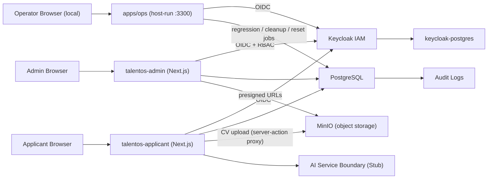
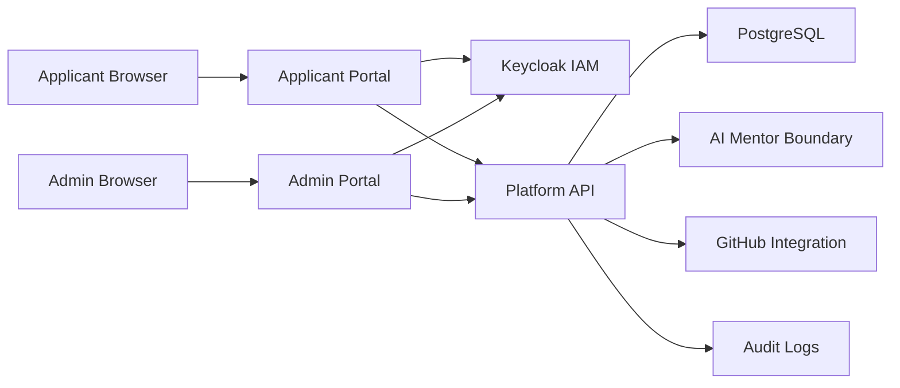
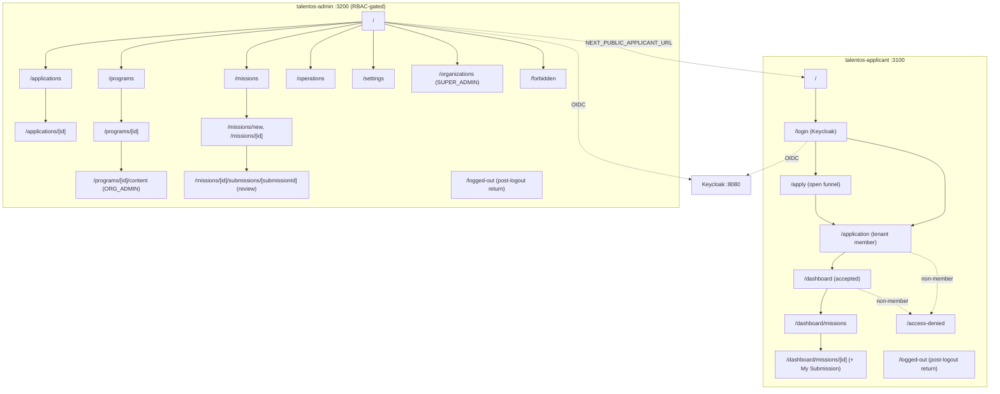

# TalentOS Architecture

Code version: `v0.19.1`

Architecture baseline commit: `_pending_`

Current documentation update: `v0.19.1`

## Overview

TalentOS is a Dockerized, multi-tenant, white-label SaaS platform for talent discovery, mission-based learning and recruitment.

The platform consists of three applications. The two portals are isolated containers as of
`v0.2.0`; the Ops Console is a host-run local tool:

- Public Applicant Portal (`apps/applicant`, container `talentos-applicant`) for landing pages, applications and applicant workflows.
- Program Admin Portal (`apps/admin`, container `talentos-admin`) for organization admins, HR, tech leads and platform super admins.
- Local Ops Console (`apps/ops`, **host-run, not containerized**): a standalone Node HTTP server on
  `127.0.0.1:3300`, authenticated via Keycloak OIDC (clients `talentos-ops`/`talentos-ops-mfa`,
  roles `SUPER_ADMIN`/`ORG_ADMIN`, optional TOTP), that runs regression, cleanup and stack-reset
  jobs against the local stack. It is a development/operations tool, not a deployed product surface.

The portal modules share only the `packages/*` libraries (`auth`, `auth-web`, `db`, `storage`, `ui`). They no longer share a process or attack surface, so they can be deployed, scaled and secured independently.

`v0.2.0` realized this separation at the container level. As of `v0.3.0`, **Keycloak is the live IAM**: both portals authenticate via OIDC (Auth.js / NextAuth v5), and the Admin Portal enforces role-based access. Signup, password policy and authenticator-app 2FA are owned by Keycloak. Org creation auto-provisions the org admin in Keycloak as of `v0.11.0`; a full Admin user/org/role management UI remains future work (see Engineering To-Do).

The architecture follows the SSDLC principle that every iteration updates architecture, data model, deployment and testing documentation.

### Applicant Dashboard (`v0.12.0`)

When an applicant's application reaches ACCEPTED status, the applicant portal exposes a `/dashboard`
route group with a fixed left sidebar (`ApplicantShell.tsx`, mirroring the admin `SidebarNav` pattern).
The dashboard layout (`app/dashboard/layout.tsx`) checks for an accepted application and redirects to
`/application` if none exists. The landing page and `/application` page also redirect to `/dashboard`
for accepted applicants. The `PortalHeader` conditionally shows "Dashboard" instead of "Apply". Seven
pages: overview, program (4-week breakdown), tasks, resources (embedded videos), calendar, notifications,
profile. Data is served by `packages/db/src/dashboard.ts` (11 query/helper functions).

As of `v0.16.0` (D-069) the overview page's Overall Progress, Missions Accepted tile and per-week
Program Progress bars are **mission-driven**: they derive from the applicant's assigned missions and
ACCEPTED mission submissions (`getApplicantMissionProgress` in `packages/db/src/submissions.ts`), not task
checkboxes — a **Current Mission** card links to the next mission with its submission-status chip,
and weekly tasks remain a supplementary checklist. The dashboard's video resources, weekly tasks
and calendar events are managed by admins from the Program Content page (`/programs/[id]/content`,
`manageProgramContent` capability).

### Mission Engine MVP (`v0.14.0`)

`v0.14.0` turns the placeholder `Mission` model into the first learning-engine capability. Admins manage
missions through `/missions`, `/missions/new` and `/missions/[id]`; `SUPER_ADMIN` and `ORG_ADMIN` can
create/edit/publish/archive while HR and Tech Lead are read-only. As of `v0.18.0`, accepted applicants
see assigned published missions for their accepted program at `/dashboard/missions` and
`/dashboard/missions/[id]`; published missions are the assignment pool rather than automatic applicant
visibility. Mission content is structured as SEM-oriented text fields: brief, objective, deliverables,
acceptance criteria, evaluation criteria and competency tags. Week 1 demo variants are sourced from
Markdown seed specs and imported into those mission fields during seed.

### Engineering Journal MVP (`v0.17.0`)

`v0.17.0` adds the first dedicated daily-reflection module to the Applicant Portal, separate from the
older inline `Submission.journalMarkdown` field retained only for data compatibility. Accepted
applicants list, create and edit structured entries at `/dashboard/journal`, `/dashboard/journal/new`
and `/dashboard/journal/[id]` (`JournalEntryForm.tsx`, `actions.ts`, `view-model.ts`); a Profile page
setting (`LanguagePreferenceForm.tsx`) controls the applicant's preferred journal language
(`User.preferredJournalLanguage`, default `"English"`). All journal data access goes through
`packages/db/src/journal.ts` — tenant-scoped and applicant-owned, validated against the applicant's
mission and program, and audited (`journal.created`/`journal.updated`). Saved entries render read-only
by default and only change through an explicit Edit action; once a mission's assignment has been
submitted, `isJournalMissionLockedForApplicant`/`assertJournalMissionNotLocked` lock that mission's
journal entries against further edits. `v0.17.1` adds a database-level unique index on
`[tenantId, applicantId, entryDate]` backing the one-entry-per-calendar-date rule that
`createJournalEntry`/`updateJournalEntry` already enforced in application code
(`JournalEntryDateConflictError`). AI-review/scoring fields on the entry are schema placeholders only
— no AI review or scoring is active yet (see `docs/developer-notes/Engineering_Journal_Notes.md`).

### Mission Assignment MVP (`v0.18.0`)

`v0.18.0` changes applicant mission visibility from "every published mission in the accepted program"
to "the missions explicitly assigned to this applicant." A new `MissionAssignment` row (tenant,
program, applicant, mission, week; unique per tenant+program+applicant+week) is created idempotently
when an application transitions to `ACCEPTED`, choosing one Week 1 published mission from the
least-assigned variants with a random tie-break. Mission listing/detail, submission drafting and
Engineering Journal mission selection are all scoped to the applicant's assignments
(`packages/db/src/mission-assignments.ts`). Four Week 1 TaskPilot mission variants are authored as
Markdown source under `packages/db/prisma/seed-data/missions/ai-native-engineering/week-1/` and
imported into standard `Mission` fields by the seed script; the app never reads the Markdown file
paths at runtime, only the imported database content.

### Mission Deadline & Lifecycle (`v0.18.5`)

`v0.18.5` gives every `MissionAssignment` an explicit time-boxed lifecycle instead of the open-ended
`v0.18.0` `ACTIVE` state. An applicant must explicitly **accept** a `NOT_STARTED` assignment
(`acceptMissionAssignment`) before evidence can be drafted; accepting is what computes and starts
`deadlineAt`/`graceEndsAt` from the mission's own `deadlineHours`/`gracePeriodHours` — an assignment
that is never accepted never expires. Deadline enforcement is **not** a request-time check: a
standalone, idempotent sweep (`packages/db/src/mission-deadlines.ts`,
`scripts/mission-deadlines/sweep.ts`, `npm run mission-deadlines:sweep`) is intended to run as an
external scheduled job (cron), deliberately kept out of the app process for future scaling. Each of
its two phases is a status-scoped `updateMany` — `ACCEPTED|IN_PROGRESS` past `deadlineAt` →
`OVERDUE`; `OVERDUE` past `graceEndsAt` with no submission → `FAILED` + `Application.status =
DISQUALIFIED` — so re-running the sweep any number of times cannot double-transition or
double-notify. A submission made after the deadline but before grace expiry is still accepted
(`LATE_SUBMITTED`). Accepting a submission auto-advances the applicant to the next week's mission,
capped at `FINAL_PROGRAM_WEEK = 4`. A `REPEAT` review decision reassigns a different published
mission for the same week that failed (`v0.19.1`; this version shipped it as a reset to Week 1); no
alternate mission moves `Application.status` to `AWAITING_MISSION_ASSIGNMENT` and notifies every
`ORG_ADMIN`/`TECH_LEAD` in the tenant. A missed deadline (`DISQUALIFIED`) is a deliberately terminal
outcome for now — a future Back Office "rejoin from Week 1" workflow is explicitly deferred.

### Mission-Driven Tasks & Submissions Admin Tab (`v0.19.0`)

`v0.19.0` replaces the applicant Tasks/Resources experience with a fixed 3-task template derived
directly from each mission assignment — Task 1 "Review the Mission Brief", Task 2 "Study the
Tutorial" (an optional `Mission.tutorialUrl`, YouTube-watch-gated via the IFrame Player API's
`onStateChange`/`YT.PlayerState.ENDED`), Task 3 "Build & Submit Evidence" (no completion row of its
own — implied complete once `Submission.status` moves beyond `DRAFT`/`NEEDS_REVISION`) — instead of
the legacy program-level `ProgramTask`/`VideoResource` content. `packages/db/src/mission-tasks.ts`
gates `saveSubmissionDraft`/`submitSubmission` on Tasks 1 and 2 being complete
(`areRequiredMissionTasksComplete`). Each task links to a per-task resource page
(`/dashboard/tasks/[assignmentId]/[taskIndex]`). The legacy tables remain in the schema, unused, by
explicit product decision; only the applicant UI and the admin Program Content authoring page (now
Calendar Events only) stop reading/writing them. A new admin **Submissions** tab (`/submissions`)
lists and filters submissions across every mission for reviewers — reusing the existing
`reviewSubmissions` capability and the existing per-submission review page, introducing no new
authorization surface.

### Dashboard Wiring & Same-Week Repeat (`v0.19.1`)

`v0.19.1` wires the Dashboard, My Program, Tasks and Missions pages to the mission-lifecycle data
`v0.18.5`/`v0.19.0` introduced: "Days Remaining" and every "current mission" countdown derive from
the applicant's actual assignment `deadlineAt` (not `Program.endsAt`); My Program's Start/End dates
derive from the Week 1 assignment's `acceptedAt` + 4 weeks; the `DeadlineCountdown` component
renders only next to the current, unsubmitted mission. It also corrects the `v0.18.5`
reject-reassignment behavior: `createRepeatFromWeekOneTx` is renamed
`createRepeatMissionForSameWeekTx` and now repeats the **same week that failed** with a different
mission, rather than always resetting to Week 1.

## Container Topology

| Module | App | Container | Host port | Internal port |
| --- | --- | --- | --- | --- |
| Applicant | `apps/applicant` | `talentos-applicant` | `3100` (`APPLICANT_PORT`) | `3000` |
| Administrator | `apps/admin` | `talentos-admin` | `3200` (`ADMIN_PORT`) | `3000` |
| Identity (IAM) | `keycloak/` | `talentos-keycloak` | `8080` (`KEYCLOAK_PORT`) | `8080` |
| App database | `packages/db` | `talentos-postgres` | `55432`/`5432` (`POSTGRES_PORT`) | `5432` |
| Keycloak database | — | `talentos-keycloak-postgres` | — (internal) | `5432` |
| Object storage | `minio/minio` | `talentos-minio` | `9000`/`9001` (`S3_PORT`/`S3_CONSOLE_PORT`) | `9000`/`9001` |
| Ops Console | `apps/ops` | — (host-run, not containerized) | `3300` (`OPS_PORT`, loopback only) | — |
| Mission deadline sweep | `scripts/mission-deadlines/sweep.ts` | — (external cron, not a service) | — | — |

## Technology Stack

- Next.js with TypeScript for the web application and server routes.
- PostgreSQL for primary data storage.
- Prisma for database schema, migrations and typed data access.
- Tailwind CSS for maintainable UI foundations.
- Docker Compose for local and VPS deployment.
- TOTP-compatible 2FA for applicant/admin authentication.

## Runtime Components

## Target Runtime Components

The future target architecture separates applicant and admin portal concerns while sharing platform services.

## Portal Layout

The applicant and admin routes live in separate containers, and each container returns 404 for the
other module's routes. As of `v0.2.1` the applicant portal exposes **no** admin navigation; only the
admin portal links back to the applicant portal (`NEXT_PUBLIC_APPLICANT_URL`).

As of `v0.11.4` the admin portal sidebar is rendered by a client component
(`apps/admin/components/SidebarNav.tsx`) that uses `usePathname()` to highlight the active nav item
(`bg-brand-blue text-white`), and the application review page (`/applications/[id]`) includes a
"← Back to Applications" link. The applicant `/apply` page uses a professional card-based layout with
branded header, sectioned form, and styled inputs.

As of `v0.14.3`, logout on both portals is centralized (`buildTenantLogoutUrl` in
`packages/auth-web`): Keycloak RP-initiated logout returns through the canonical host's
`/logged-out` route with the tenant origin carried in the OIDC `state` parameter, then bounces the
user back to their tenant subdomain via the allow-listed `resolveTenantRedirect`.

## Portal Separation Direction

`v0.2.0` separated the applicant and admin routes into two independently deployable containers (`talentos-applicant` and `talentos-admin`). The remaining engineering target is:

- Separate Applicant Portal for public landing, signup, application, learning missions and portfolio experience.
- Separate Admin Portal for tenant owner/admin operations, program management, application review, mission configuration, knowledge base management and hiring recommendations.
- Shared platform services for IAM, database access, audit logging, AI, GitHub integration and certificates.
- Independent deployment path for each portal so scaling, security policy and release cadence can diverge when needed.

## Multi-Tenancy

TalentOS uses a shared PostgreSQL database with tenant-scoped records.

- Tenants are resolved from subdomains such as `sbp.talentos.app` (`resolveTenantFromHost`).
- Local development addresses tenants at `<slug>.lvh.me:<port>` (`v0.12.1`); `lvh.me` and `*.lvh.me`
  resolve to `127.0.0.1` with no host-file setup. `APP_BASE_DOMAIN` (`lvh.me` locally, the real base
  domain in production) drives both host resolution and the auth cookie scope below.
- Tenant-owned entities include `tenantId`.
- Application code must enforce tenant isolation before reading or mutating tenant-owned data.
- Tenants are created by the platform SUPER_ADMIN through the Admin Portal Organizations console
  (`v0.10.0`); each tenant carries white-label branding — name, brand colors and logo — applied to both
  portals by host resolution (`v0.9.0`).

### Cross-subdomain authentication (`v0.12.1`, D-060)

next-auth (v5 beta) derives the OIDC `redirect_uri` from a **pinned `AUTH_URL`** and cannot mint a
per-subdomain callback (a reverse proxy forwarding `X-Forwarded-Host` does *not* change this). So tenant
login uses a canonical-host + shared-cookie model rather than per-subdomain callbacks:

- Login always runs through one canonical host per app (`AUTH_URL`, e.g. `lvh.me:3200`), giving a stable
  `redirect_uri` registered on the Keycloak client.
- Auth cookies (session/CSRF/state/PKCE/nonce) are scoped to the parent base domain (`Domain=.lvh.me`)
  by `packages/auth-web`, so the session established during the canonical-host callback is valid on every
  tenant subdomain. (`localhost` is a single-label host and cannot carry a `Domain` cookie, so this is
  gated on `APP_BASE_DOMAIN` being a real multi-label domain; otherwise next-auth's host-only defaults
  apply and the deployment behaves as single-host.)
- After the callback, the app redirects the user back to their tenant subdomain. `resolveTenantRedirect`
  allows only the canonical origin and subdomains of `APP_BASE_DOMAIN` — an allow-list, not an open
  redirect — and the middlewares pass the absolute tenant URL as `callbackUrl` so the subdomain survives.
- The tenant guard (`resolveTenantAccess`, D-051) is unchanged: it still binds the shared session to the
  `Host`-resolved tenant via DB membership. An org admin who lands on their subdomain with the shared
  cookie now passes the membership check instead of being denied.

### Local OIDC hostname rule (`v0.12.2`, D-061)

Local development must use a single OIDC issuer URL that is reachable from both the browser and the
Docker containers, and that exactly matches the Keycloak `iss` claim. The supported local issuer is
`http://keycloak.lvh.me:8080/realms/talentos`; the Keycloak container advertises
`KC_HOSTNAME=http://keycloak.lvh.me:8080`, and app containers map `keycloak.lvh.me` to the Docker host
gateway. This avoids the earlier split where browser flows used `localhost` while containers used
`host.docker.internal`, which caused unreachable login-action URLs and `unexpected "iss" claim value`
errors. The same pattern is used for browser-visible object storage URLs with `http://minio.lvh.me:9000`.

## Security Model

- **Keycloak is the live IAM** (as of `v0.3.0`) for authentication, password policy, first-login
  password change, authenticator-app (TOTP) setup and role/session management. TalentOS does not store
  raw passwords; `User.passwordHash` is legacy/optional.
- Both portals authenticate via OIDC (Auth.js / NextAuth v5, JWT sessions); the access token's realm
  roles are mapped to the application roles.
- Roles: `SUPER_ADMIN` (platform) and the org-scoped `ORG_ADMIN` / `HR` / `TECH_LEAD` / `APPLICANT`.
  Admin-portal access requires SUPER_ADMIN or ORG_ADMIN/HR/TECH_LEAD; APPLICANT is denied (redirected to
  `/forbidden`). Authorization is a capability matrix in `packages/auth/src/permissions.ts`.
- Cross-tenant access is rejected by shared authorization utilities; sensitive actions are recorded in
  `AuditLog`.
- AI workflow boundaries are explicit so future AI mentor activity can be audited.
- **Object storage** (`v0.7.0`, MinIO) keeps the bucket private; files transfer directly between the
  browser and MinIO via short-lived presigned URLs; object keys are tenant-namespaced
  (`tenant/{tenantId}/{category}/…`) and `StoredFile` metadata is tenant-scoped and audited.
- **CV on apply** (`v0.7.3`) — the applicant apply server action validates the CV server-side
  (PDF, ≤ 5 MB), streams it to MinIO via `putObject` (`category: "cv"`), records a `READY`
  `StoredFile`, and links it through `Application.cvFileId`; optional GitHub/LinkedIn URLs are
  host-allowlisted. Admin downloads the CV through the tenant-scoped `/api/files/[id]/download` route.
- **Tenant settings / white-label** (`v0.9.0`) — branding edits are gated by the `manageTenantSettings`
  capability (ORG_ADMIN/SUPER_ADMIN), scoped to the host-resolved tenant and audited
  (`tenant.branding_updated`). Colors are validated server-side against `^#[0-9a-fA-F]{6}$` before being
  persisted or injected into a `<style>` block (CSS-injection guard). Logo uploads are content-type
  allowlisted to PNG/JPEG/WebP (**SVG rejected** as an XSS vector) and size-capped. The logo is served
  on the applicant portal's public pages by the unauthenticated `/api/branding/logo` route, which is
  **IDOR-safe** — it resolves the tenant from the host and returns only that tenant's own logo
  (`Tenant.logoFileId` → `StoredFile`), never an arbitrary file id.
- **Organizations console** (`v0.10.0`) — tenant creation is gated by `createOrganization`
  (SUPER_ADMIN only). The slug is validated by `isValidTenantSlug` (DNS-safe, since it becomes the
  tenant subdomain; `v0.11.1` also rejects a `RESERVED_SLUGS` blocklist — `www`/`admin`/`api`/`demo`/…);
  the create writes the tenant, an ORG_ADMIN `TenantMembership`, and an `organization.created` audit row
  in one transaction.
- **Duplicate-application guard** (`v0.11.1`, index via PR #13) — a partial unique index
  `applications (applicantId, programId) WHERE status IN (DRAFT, SUBMITTED, UNDER_REVIEW, ACCEPTED,
  WAITLISTED)` backstops the app-layer check against races; REJECTED is excluded so a rejected applicant
  may re-apply.
- **Org-admin auto-provisioning** (`v0.11.0`) — creating an organization now provisions the org admin in
  Keycloak (no manual `kcadm`). `provisionOrgAdmin` (`apps/admin/lib/keycloak-admin.ts`, server-only)
  authenticates with the confidential `talentos-provisioner` service account (client_credentials;
  realm-management `manage-users`/`manage-realm`/`view-users`) and creates the user with `emailVerified`,
  a single required action (`UPDATE_PASSWORD` — 2FA setup was withdrawn in `v0.14.2`/D-065, so no
  `CONFIGURE_TOTP`) and a one-time temp password (shown once in the UI), then grants the `ORG_ADMIN` realm
  role — idempotent (an existing user just gains the role). With v0.10.3/v0.10.4
  this closes the loop: realm role gates portal entry, `TenantMembership` gates authority, and
  `keycloakSubjectId` links on first login.
- **First-login TOTP** (`v0.10.1`) — the realm import pins a valid OTP policy
  (`otpPolicyType: totp`, period 30, digits 6, HmacSHA1) so authenticator-app enrollment cannot divide
  by zero; a unit test (`realm-otp.test.ts`) guards the non-zero period.
- **SSO logout** (`v0.10.2`) — logout is OIDC RP-initiated: after `signOut({ redirect: false })` the
  browser is redirected to Keycloak's `end_session_endpoint` (`id_token_hint` + a client-registered
  `post_logout_redirect_uri`, built by `buildEndSessionUrl` in `packages/auth-web`), which terminates
  the Keycloak SSO session instead of only clearing the app cookie. Post-logout redirects are restricted
  to each client's registered origin (`post.logout.redirect.uris`), preventing open redirects.
- **Per-tenant RBAC (`v0.10.3`, closes the former D-048 limitation):** admin authorization is bound to
  the DB `TenantMembership`, not the realm-wide Keycloak role. A shared guard
  (`apps/admin/lib/tenant-guard.ts` → `resolveTenantAccess`/`requireTenantAccess`, backed by
  `getActorTenantRoles` in `packages/db` and `tenantRolesGrant` in `packages/auth`) resolves
  session → host tenant → membership and authorizes only when the actor holds a capable role **in the
  resolved tenant**; `SUPER_ADMIN` (platform role) bypasses. It gates the admin layout (all page reads),
  every mutating action (`managePrograms`/`reviewApplications`/`manageTenantSettings`), and the sensitive
  route handlers (candidate-CV download, operations health). The Keycloak realm role now serves only as
  the coarse *portal-entry* gate (middleware). Defense-in-depth: `updateProgram`/`setProgramStatus`/
  `applyStatusTransition` write via `updateMany({ where: { id, tenantId } })` so a raw id cannot cross
  tenants. (Keycloak org-admin auto-provisioning has since shipped in `v0.11.0`; the remaining
  related work is the full Admin Users/Roles management UI — see the Engineering To-Do.)
- **Per-tenant RBAC for the applicant portal (`v0.14.2`, D-065 — parity with D-051):** the applicant
  portal now applies the same binding. A mirror guard (`apps/applicant/lib/tenant-guard.ts` →
  `resolveTenantAccess`/`requireTenantAccess`, same `getActorTenantRoles` + `tenantRolesGrant`
  primitives) gates `/dashboard` and `/application` on `accessApplicantPortal` **in the Host-resolved
  tenant**; a non-member (previously admitted because the shared `.lvh.me` session carried across
  subdomains, D-060) is redirected to a standalone `/access-denied` page instead of another tenant's
  portal. `SUPER_ADMIN` bypasses. `/apply` stays intentionally open — it is the public recruitment funnel
  and `provisionApplicantUser` creating an `APPLICANT` membership is the legitimate self-enrollment path —
  but an existing member of the tenant is redirected to `/application`. Self-registration
  (`registrationAllowed`/`registrationEmailAsUsername`) is pinned by a realm-import assertion so a fresh
  realm cannot silently disable "Create account".
- **Identity linking & email normalization (`v0.10.4`):** the DB `User` is the local mirror of the
  Keycloak identity, joined by email. Emails are normalized (`normalizeEmail`, lowercased/trimmed) on
  every write and `getUserByEmail` is case-insensitive, so the case-sensitive unique index cannot spawn
  duplicate identities or orphan lookups. `keycloakSubjectId` is backfilled on login for existing rows by
  `linkKeycloakIdentity`, called best-effort from the admin guard — kept out of the edge-safe auth
  callbacks (no DB at the edge) and never creating rows (applicant rows are still born on first apply).
  The Keycloak `email_verified` claim is surfaced as `session.user.isEmailVerified` for future gating but
  is **not** enforced (deferred until SMTP-backed verification exists).

## Scalability

The web application is stateless and can run multiple containers behind a reverse proxy.

For 1,000 simultaneous applicants, the first scaling path is:

- multiple web containers,
- PostgreSQL indexes and connection pooling,
- background workers for long-running AI, email and GitHub jobs,
- caching for public tenant/program content.

## Deployment

The deployment target is Docker Compose on a VPS with:

- `applicant` service running the applicant Next.js application,
- `admin` service running the administrator Next.js application,
- `postgres` service running PostgreSQL,
- future `worker` service for background processing.

Both web services build from one parameterized root `Dockerfile` (build args `APP_NAME` / `APP_DIR`).

## Software Design Notes

The architecture establishes clear seams between modules and shared libraries:

- `packages/auth` contains reusable security, RBAC (roles + capability matrix), tenant and workflow utilities.
- `packages/auth-web` wraps NextAuth v5 + the Keycloak OIDC provider (`createTalentosAuth`), with edge-safe realm-role decoding shared by both apps. As of `v0.10.2` it persists the Keycloak `id_token` and exposes `buildEndSessionUrl` for RP-initiated (SSO) logout.
- `packages/db` owns Prisma schema and database access.
- `packages/db` also owns `RegressionDataMarker`, which lets local regression cleanup target only data
  explicitly generated by regression workflows.
- `packages/storage` (`@talentos/storage`) wraps the S3 API (MinIO) — presigned upload/download,
  `deleteObject`, and tenant-namespaced key building.
- `packages/ui` owns shared front-end pieces (presentational components, tenant header helper, Tailwind brand preset) consumed by both apps. As of `v0.9.0` the Tailwind brand colors are CSS variables (`--brand-blue`/`--brand-navy`/`--brand-mist`) with hex fallbacks, and `brandStyleBlock(tenant)` emits a per-tenant `<style>` block injected in each portal's root layout so a tenant's saved colors theme both portals live with no component changes.
- `apps/applicant` owns the public/applicant routes, UI, middleware and API endpoints.
- `apps/admin` owns the administrator routes, UI and middleware, served at the container root, gated by RBAC.
- `apps/admin` includes `/operations`, a local-development dashboard for app-visible health checks,
  area-based scenario regression commands, marker-based cleanup guidance and local reset instructions.
  It does not execute Docker reset commands from the web app.
- `keycloak/import` owns the realm definition (roles, clients, password policy, demo users).
- AI mentor integration is represented by a stubbed service boundary in the applicant app.

## Scenario Regression Architecture (`v0.13.0`)

TalentOS now has two regression layers:

- Unit regression: the existing Vitest suite, run as `npm.cmd run regression:unit`.
- Scenario regression: local development scenarios grouped by logical product area and run by
  `scripts/regression/run.ts`.

The Ops Console exposes the scenario suite as an area selector. Operators can run the full suite or one
area at a time: `auth`, `applicant`, `admin`, `programs`, `tenant`, `dashboard`, `storage`, `ops`, or
`unit`. As of `v0.14.0`, `missions` is also an area; as of `v0.18.2`, `journal` is too. Each run emits
a machine-readable `REGRESSION_RESULT_JSON` payload containing total, passed, failed, skipped and
duration counts; the Ops job runner parses that payload and renders the summary and raw logs.

Scenario-generated records must be tagged through `RegressionDataMarker` before cleanup is allowed.
The cleanup path deletes only marker-tagged records in dependency order and must not touch seeded demo
data or user-created records.

## Engineering To-Do List

The engineering backlog below maps the Product Backlog into near-term deliverables.

### Platform Foundation

1. IAM with Keycloak — foundation implemented in `v0.3.0`
   - Done: Keycloak is the IAM; both portals authenticate via OIDC and the admin portal enforces RBAC.
   - Done: 5-role model (`SUPER_ADMIN` platform; `ORG_ADMIN`/`HR`/`TECH_LEAD`/`APPLICANT` org-scoped),
     password policy and first-login password/TOTP, seeded Super Admin.
   - Done (`v0.7.1`): applicant self-signup via Keycloak self-registration (default role APPLICANT;
     portal "Create account" using OIDC `prompt=create`).
   - Done (`v0.10.0`): SUPER_ADMIN Organizations console — create tenants and assign the first ORG_ADMIN
     by email (DB `User` + `TenantMembership`), audited as `organization.created`.
   - Done (`v0.11.0`): the matching Keycloak identity + `ORG_ADMIN` realm role are now **auto-provisioned**
     via the Admin REST API (service-account client, one-time temp password) — no manual `kcadm` step.
   - Done (`v0.9.0`): tenant settings / white-label configuration — admin-gated
     (`manageTenantSettings`) branding (name, colors, logo) persisted, audited and applied live to both
     portals via CSS variables; logos stored in MinIO (`Tenant.logoFileId`).
   - Done (`v0.10.1`): pinned the realm OTP policy so first-login authenticator-app enrollment works.
   - Done (`v0.10.2`): RP-initiated Keycloak logout so sign-out terminates the SSO session.
   - Next: a full Admin Portal Users/Roles management UI (list/edit/deactivate users, manage roles) on
     top of the `v0.11.0` Keycloak Admin REST integration. Per-tenant role enforcement already shipped in
     `v0.10.3`; org-admin auto-provisioning shipped in `v0.11.0`.

2. Separate Applicant Portal and Admin Portal — implemented in `v0.2.0`
   - Done: applicant and admin modules split into independent `apps/applicant` and `apps/admin` containers.
   - Applicant Portal owns public application and participant-facing workflows.
   - Admin Portal owns tenant operations, application review and program management.

### MVP Product Modules

3. Applications — delivered in `v0.5.0`
   - Done: authenticated apply → submit and admin review (accept/reject/under-review/waitlist) with
     tenant-scoped persistence, the `reviewApplications` capability gate, status-transition guards and
     `AuditLog` events (`application.submitted`, `application.status_changed`).
   - Data-access helpers live in `packages/db/src` (`applications.ts`, `users.ts`, `tenants.ts`,
     `programs.ts`); apply and review are Next.js server actions.

4. Programs — delivered in `v0.6.0`
   - Done: admin CRUD (create/edit/publish/archive) gated by the `managePrograms` capability, with a
     `DRAFT ⇄ PUBLISHED ⇄ ARCHIVED` state machine, tenant scoping and `AuditLog` events
     (`program.created`, `program.updated`, `program.status_changed`). Published programs feed the
     applicant apply form.
   - Next: cohorts and public per-program application entry points.

5. Missions — mission engine delivered in `v0.14.0`, submissions in `v0.15.0`, full seed in `v0.15.1`
   - Done: admin create/edit/publish/archive missions; accepted applicants view published missions in
     their dashboard; mission submission + staff review loop (`v0.15.0`, D-067:
     `DRAFT→SUBMITTED→ACCEPTED|NEEDS_REVISION`, evidence = GitHub/deployment/Loom URLs + inline
     engineering journal, `reviewSubmissions` capability); demo seed provides the complete four-week
     TaskPilot SEM mission arc (`v0.15.1`, D-068).
   - Mission-driven dashboard progress (v0.16.0, D-069): the applicant dashboard's Overall
     Progress, Missions Accepted tile and per-week bars derive from ACCEPTED submissions
     (getApplicantMissionProgress), with a Current Mission card linking to the next mission.
   - Mission assignment MVP (v0.18.0): accepted applicants receive assigned published missions instead
     of seeing the whole published mission pool. Week 1 seed variants are authored in Markdown and
     imported into mission fields for future AI-review context.
   - Mission deadline & lifecycle (v0.18.5, D-080): explicit Accept Mission action starts a
     per-mission deadline/grace countdown; an idempotent external sweep script transitions
     `OVERDUE`/`FAILED`+`DISQUALIFIED`; accepting a submission auto-advances the applicant to the
     next week (capped at week 4); a `REPEAT` decision reassigns an alternate mission for the same
     week that failed (corrected from a Week 1 reset at `v0.19.1`, D-082), notifying reviewers when
     no alternate mission exists.
   - Mission-driven tasks & Submissions admin tab (v0.19.0, D-081): a fixed 3-task template per
     assignment (Review Brief / Study Tutorial with YouTube watch-gate / Build & Submit Evidence)
     gates submission; a new admin Submissions tab lists/filters submissions across all missions.
     Replaces the legacy `ProgramTask`/`VideoResource` applicant-facing UI (tables kept, unused).
   - Dashboard wiring (v0.19.1, D-082): Dashboard/My Program/Tasks/Missions pages read the real
     mission-lifecycle deadline and task-completion data instead of program-level placeholders.
   - Next: competency rollup / portfolio view over accepted submissions; a Back Office "rejoin from
     Week 1" workflow for disqualified applicants (explicitly deferred, not yet designed).

6. Engineering Journal — delivered in `v0.17.0`, date-uniqueness hardened in `v0.17.1`
   - Done: dedicated daily structured-reflection module (`EngineeringJournalEntry`) at
     `/dashboard/journal`, separate from the older inline `Submission.journalMarkdown` field;
     tenant-scoped, applicant-owned, audited (`journal.created`/`journal.updated`); one entry per
     applicant per calendar date enforced at the database layer (`v0.17.1`, D-074); entries lock once
     their mission's assignment is submitted (`v0.18.0`).
   - Done: read-only assignment-scoped visibility on the admin submission review page.
   - Next: real AI review/scoring (current fields are schema placeholders only), recruiter visibility,
     export/weekly-summary features.

7. AI Mentor — delivered in `v0.15.0`
   - Done: full conversational AI mentor at `/dashboard/mentor` for accepted applicants. The chat UI
     (`apps/applicant/app/dashboard/mentor/page.tsx`) supports multi-conversation management with
     per-conversation loading state, auto-scroll, suggested questions, and a "Still working..." timer.
     Messages render Markdown (`react-markdown` + `remark-gfm` + Prism syntax highlighting) and rich
     cards (`CardRenderer.tsx`: task, progress, timeline, tips, badge, warning) via a `cardsJson` field.
     Conversations persist to `localStorage` (`talentos:mentor-conversations`) and to the database
     (`MentorConversation` / `MentorMessage` models in `packages/db/src/mentor.ts`).
   - **API route** (`apps/applicant/app/api/ai/mentor/route.ts`): `GET` loads conversation history,
     `POST` accepts a prompt with auth guard + Zod validation, builds applicant context, retrieves
     knowledge-base snippets, calls the LLM, and persists the exchange.
   - **LLM integration** (`apps/applicant/lib/ai.ts`): `callGLM` calls ZhipuAI GLM-4.5-air with
     1024 max tokens, 60 s timeout, and 1 retry. `buildSystemPrompt` assembles the system persona.
     `requestAIInteraction` orchestrates: RBSE classification → LLM call → stub fallback on failure.    A **smart in-memory response cache** (`LLM_RESPONSE_CACHE`, D-070) avoids redundant LLM calls:
    dynamic prompts (user-specific) are keyed by `tenant + user + contextSignature + prompt`, while
    static knowledge prompts are keyed by `prompt` only (shared across users). The cache has a 5-minute
    TTL, 200-entry cap with LRU eviction, and never caches errors. The context signature
    (`buildContextSignature` in `ai-context.ts`) hashes program, progress, task, mission, and submission
    state so any context change invalidates the dynamic cache entry.   - **RBSE classifier** (`apps/applicant/lib/ai-rbse.ts`): rule-based engine that classifies user
     input into `blocked`, `direct_answer`, or `allow_llm` actions against an `ALLOWED_TOPICS` list.
   - **Knowledge base** (`apps/applicant/lib/knowledge-base.ts`): keyword-based retrieval from
     platform docs (SDLC, SEM, Mission Framework, etc.) with score ranking and a limit of 2 snippets.
   - **Applicant context** (`apps/applicant/lib/ai-context.ts`): `buildApplicantContext` assembles
     program, progress, upcoming tasks, missions — all tenant-scoped.
   - Next: LiteLLM proxy integration, streaming responses, multi-turn context windowing,
    edge/Redis-backed cache for multi-instance deployments.

8. Knowledge Base
   - The initial knowledge base is implemented as keyword-based retrieval from platform documentation
     (`apps/applicant/lib/knowledge-base.ts`). Future: tenant-owned knowledge documents for AI
     assistance and program support via a `KnowledgeBaseDocument` model.

9. GitHub Integration
   - Connect participant repositories and collect project evidence.

10. Portfolio
    - Generate participant-facing public portfolio artifacts.

11. Certificates
    - Support tenant-branded certificate creation and issuance.

12. Leaderboard
    - Add transparent progress and achievement visibility.

13. Hiring Recommendations
    - Produce admin-facing candidate readiness and hiring signals.
