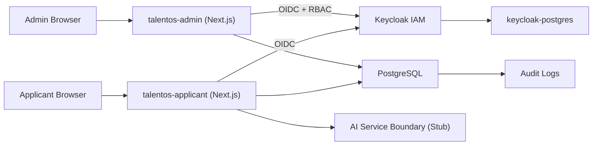
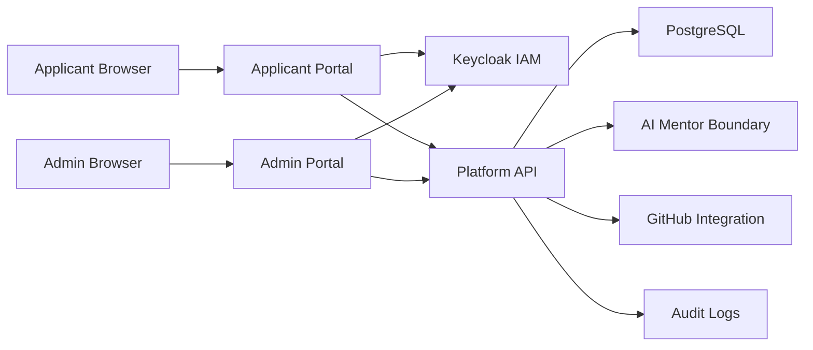
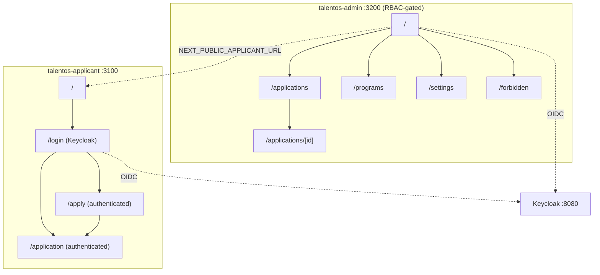

# TalentOS Architecture

Code version: `v0.6.0`

Architecture baseline commit: `4e2390ce270ef1e049652495885d792a0cbed959`

Current documentation update: `v0.6.0`

## Overview

TalentOS is a Dockerized, multi-tenant, white-label SaaS platform for talent discovery, mission-based learning and recruitment.

The platform exposes two portals, and as of `v0.2.0` each portal is an isolated application running in its own container:

- Public Applicant Portal (`apps/applicant`, container `talentos-applicant`) for landing pages, applications and applicant workflows.
- Program Admin Portal (`apps/admin`, container `talentos-admin`) for organization admins, HR, tech leads and platform super admins.

The two modules share only the `packages/*` libraries (`auth`, `auth-web`, `db`, `ui`). They no longer share a process or attack surface, so they can be deployed, scaled and secured independently.

`v0.2.0` realized this separation at the container level. As of `v0.3.0`, **Keycloak is the live IAM**: both portals authenticate via OIDC (Auth.js / NextAuth v5), and the Admin Portal enforces role-based access. Signup, password policy and authenticator-app 2FA are owned by Keycloak. The full Admin user/org/role management UI (Keycloak Admin REST API) follows in `v0.3.1`.

The architecture follows the SSDLC principle that every iteration updates architecture, data model, deployment and testing documentation.

## Container Topology

| Module | App | Container | Host port | Internal port |
| --- | --- | --- | --- | --- |
| Applicant | `apps/applicant` | `talentos-applicant` | `3100` (`APPLICANT_PORT`) | `3000` |
| Administrator | `apps/admin` | `talentos-admin` | `3200` (`ADMIN_PORT`) | `3000` |
| Identity (IAM) | `keycloak/` | `talentos-keycloak` | `8080` (`KEYCLOAK_PORT`) | `8080` |
| App database | `packages/db` | `talentos-postgres` | `55432`/`5432` (`POSTGRES_PORT`) | `5432` |
| Keycloak database | — | `talentos-keycloak-postgres` | — (internal) | `5432` |

## Technology Stack

- Next.js with TypeScript for the web application and server routes.
- PostgreSQL for primary data storage.
- Prisma for database schema, migrations and typed data access.
- Tailwind CSS for maintainable UI foundations.
- Docker Compose for local and VPS deployment.
- TOTP-compatible 2FA for applicant/admin authentication.

## Runtime Components

## Target Runtime Components

The future target architecture separates applicant and admin portal concerns while sharing platform services.

## Portal Layout

The applicant and admin routes live in separate containers, and each container returns 404 for the
other module's routes. As of `v0.2.1` the applicant portal exposes **no** admin navigation; only the
admin portal links back to the applicant portal (`NEXT_PUBLIC_APPLICANT_URL`).

## Portal Separation Direction

`v0.2.0` separated the applicant and admin routes into two independently deployable containers (`talentos-applicant` and `talentos-admin`). The remaining engineering target is:

- Separate Applicant Portal for public landing, signup, application, learning missions and portfolio experience.
- Separate Admin Portal for tenant owner/admin operations, program management, application review, mission configuration, knowledge base management and hiring recommendations.
- Shared platform services for IAM, database access, audit logging, AI, GitHub integration and certificates.
- Independent deployment path for each portal so scaling, security policy and release cadence can diverge when needed.

## Multi-Tenancy

TalentOS uses a shared PostgreSQL database with tenant-scoped records.

- Tenants are resolved from subdomains such as `demo.talentos.app`.
- Local development supports tenant simulation with hosts such as `demo.localhost`.
- Tenant-owned entities include `tenantId`.
- Application code must enforce tenant isolation before reading or mutating tenant-owned data.

## Security Model

- **Keycloak is the live IAM** (as of `v0.3.0`) for authentication, password policy, first-login
  password change, authenticator-app (TOTP) setup and role/session management. TalentOS does not store
  raw passwords; `User.passwordHash` is legacy/optional.
- Both portals authenticate via OIDC (Auth.js / NextAuth v5, JWT sessions); the access token's realm
  roles are mapped to the application roles.
- Roles: `SUPER_ADMIN` (platform) and the org-scoped `ORG_ADMIN` / `HR` / `TECH_LEAD` / `APPLICANT`.
  Admin-portal access requires SUPER_ADMIN or ORG_ADMIN/HR/TECH_LEAD; APPLICANT is denied (redirected to
  `/forbidden`). Authorization is a capability matrix in `packages/auth/src/permissions.ts`.
- Cross-tenant access is rejected by shared authorization utilities; sensitive actions are recorded in
  `AuditLog`.
- AI workflow boundaries are explicit so future AI mentor activity can be audited.

## Scalability

The web application is stateless and can run multiple containers behind a reverse proxy.

For 1,000 simultaneous applicants, the first scaling path is:

- multiple web containers,
- PostgreSQL indexes and connection pooling,
- background workers for long-running AI, email and GitHub jobs,
- caching for public tenant/program content.

## Deployment

The deployment target is Docker Compose on a VPS with:

- `applicant` service running the applicant Next.js application,
- `admin` service running the administrator Next.js application,
- `postgres` service running PostgreSQL,
- future `worker` service for background processing.

Both web services build from one parameterized root `Dockerfile` (build args `APP_NAME` / `APP_DIR`).

## Software Design Notes

The architecture establishes clear seams between modules and shared libraries:

- `packages/auth` contains reusable security, RBAC (roles + capability matrix), tenant and workflow utilities.
- `packages/auth-web` wraps NextAuth v5 + the Keycloak OIDC provider (`createTalentosAuth`), with edge-safe realm-role decoding shared by both apps.
- `packages/db` owns Prisma schema and database access.
- `packages/ui` owns shared front-end pieces (presentational components, tenant header helper, Tailwind brand preset) consumed by both apps.
- `apps/applicant` owns the public/applicant routes, UI, middleware and API endpoints.
- `apps/admin` owns the administrator routes, UI and middleware, served at the container root, gated by RBAC.
- `keycloak/import` owns the realm definition (roles, clients, password policy, demo users).
- AI mentor integration is represented by a stubbed service boundary in the applicant app.

## Engineering To-Do List

The engineering backlog below maps the Product Backlog into near-term deliverables.

### Platform Foundation

1. IAM with Keycloak — foundation implemented in `v0.3.0`
   - Done: Keycloak is the IAM; both portals authenticate via OIDC and the admin portal enforces RBAC.
   - Done: 5-role model (`SUPER_ADMIN` platform; `ORG_ADMIN`/`HR`/`TECH_LEAD`/`APPLICANT` org-scoped),
     password policy and first-login password/TOTP, seeded Super Admin.
   - Next (`v0.3.1`): Admin Portal Organizations/Users/Roles management UI via the Keycloak Admin REST API.

2. Separate Applicant Portal and Admin Portal — implemented in `v0.2.0`
   - Done: applicant and admin modules split into independent `apps/applicant` and `apps/admin` containers.
   - Applicant Portal owns public application and participant-facing workflows.
   - Admin Portal owns tenant operations, application review and program management.

### MVP Product Modules

3. Applications — delivered in `v0.5.0`
   - Done: authenticated apply → submit and admin review (accept/reject/under-review/waitlist) with
     tenant-scoped persistence, the `reviewApplications` capability gate, status-transition guards and
     `AuditLog` events (`application.submitted`, `application.status_changed`).
   - Data-access helpers live in `packages/db/src` (`applications.ts`, `users.ts`, `tenants.ts`,
     `programs.ts`); apply and review are Next.js server actions.

4. Programs — delivered in `v0.6.0`
   - Done: admin CRUD (create/edit/publish/archive) gated by the `managePrograms` capability, with a
     `DRAFT ⇄ PUBLISHED ⇄ ARCHIVED` state machine, tenant scoping and `AuditLog` events
     (`program.created`, `program.updated`, `program.status_changed`). Published programs feed the
     applicant apply form.
   - Next: cohorts and public per-program application entry points.

5. Missions
   - Implement mission lifecycle aligned to the Spiral Engineering Method.

6. AI Mentor Boundary
   - Expand the current AI service boundary into tenant-aware, auditable mentor workflows.

7. Knowledge Base
   - Add tenant-owned knowledge documents for AI assistance and program support.

8. GitHub Integration
   - Connect participant repositories and collect project evidence.

9. Portfolio
   - Generate participant-facing public portfolio artifacts.

10. Certificates
    - Support tenant-branded certificate creation and issuance.

11. Leaderboard
    - Add transparent progress and achievement visibility.

12. Hiring Recommendations
    - Produce admin-facing candidate readiness and hiring signals.
