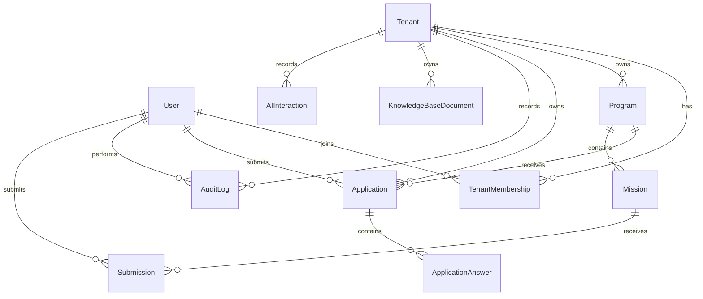

# Data Model

Code version: `v0.1.0`

Baseline commit: `4e2390ce270ef1e049652495885d792a0cbed959`

## Entity Relationship Overview

## Core Entities

- `Tenant`: white-label organization using TalentOS.
- `User`: shared identity for applicants, tenant owners and admins.
- `TenantMembership`: user role within a tenant.
- `Program`: tenant-owned learning/recruitment program.
- `Application`: applicant submission to a program.
- `ApplicationAnswer`: structured answers inside an application.
- `AuditLog`: security and business action history.

## Future-Ready Entities

- `Mission`: mission-based learning assignment.
- `Submission`: participant mission deliverable.
- `PortfolioArtifact`: public engineering portfolio item.
- `Certificate`: tenant-issued certificate.
- `KnowledgeBaseDocument`: tenant-owned knowledge content.
- `AIInteraction`: auditable AI mentor/assistant interaction metadata.

## Tenant Isolation Rule

Every tenant-owned table includes `tenantId`. Queries for tenant-owned data must filter by the active tenant, and authorization checks must reject cross-tenant access.
