# Data Model

Code version: `v0.19.5`

Schema evidence commit: `2b3afce`

> `v0.19.5` weekly-task/submission-readiness work evolves the existing `ProgramTask`, `VideoResource`,
> and `UserTaskCompletion` models instead of creating parallel models. Tasks remain scoped by
> tenant/program/week and gain `required` and `published` flags. The legacy-named `VideoResource`
> becomes a reusable task resource with `MARKDOWN`/`YOUTUBE` type, optional `taskId`, optional URL,
> Markdown content, ordering, and optional duration. Task completions gain an authoritative
> `tenantId` and are unique on `[tenantId, userId, taskId]`. Migration:
> `20260716090000_weekly_tasks_submission_readiness`.
>
> `v0.19.2` (Logout Regression Fix & Confirmation Gates, D-083) makes no schema change — a restored
> UI affordance, a Vitest alias fix and a governance-only `AGENTS.md` addition.
>
> `v0.19.1` (Dashboard Wiring & Same-Week Repeat, D-082) makes no schema change. It renames
> `createRepeatFromWeekOneTx` to `createRepeatMissionForSameWeekTx` (now parameterized by the
> failed assignment's own `weekNumber` instead of assuming `1`) and rewires several applicant pages
> to already-shipped fields (`MissionAssignment.deadlineAt`, `acceptedAt`) — no new columns or
> tables.
>
> `v0.19.0` (Mission-Driven Tasks & Submissions Admin Tab, D-081) adds `Mission.tutorialUrl`
> (String?, optional YouTube tutorial link) and a new `MissionTaskCompletion` model (`id`,
> `tenantId`, `missionAssignmentId` FK→mission_assignments Cascade, `taskIndex` (1 or 2),
> `completedAt`), unique on `[missionAssignmentId, taskIndex]`. Task 3 ("Build & Submit Evidence")
> has no completion row — it is derived from the linked `Submission.status` moving beyond `DRAFT`/
> `NEEDS_REVISION`. The later weekly-task/readiness slice reuses `ProgramTask`, `VideoResource`, and
> `UserTaskCompletion` as a separate program-week learning track; `MissionTaskCompletion` remains the
> assignment-attempt workflow-step model. Migration: `20260714110000_mission_tasks`.
>
> `v0.18.5` (Mission Deadline & Lifecycle, D-080) adds `Mission.deadlineHours` (Int, default 168)
> and `Mission.gracePeriodHours` (Int, default 24); adds `MissionAssignment.acceptedAt`/
> `deadlineAt`/`graceEndsAt` (all nullable DateTime, set on explicit accept); changes the
> `MissionAssignment` default status to `NOT_STARTED` and rebuilds `MissionAssignmentStatus` to
> `NOT_STARTED, ACCEPTED, IN_PROGRESS, PENDING_EVALUATION, LATE_SUBMITTED, OVERDUE, FAILED, PASSED,
> REPEAT` (replacing the `v0.18.0`-era `ACTIVE`/`SUBMITTED` two-state model); extends
> `ApplicationStatus` with `DISQUALIFIED` (grace period expired with no submission — terminal) and
> `AWAITING_MISSION_ASSIGNMENT` (a `REPEAT` decision had no alternate mission to reassign). Both new
> `ApplicationStatus` values are terminal in `packages/auth/src/workflow.ts` — no admin-initiated
> transition leaves them. Migration: `20260714090000_mission_deadlines_and_lifecycle`.
>
> `v0.15.0` (AI Mentor MVP, D-066) adds `MentorConversation` (`id`, `tenantId`, `userId`, `title`,
> `createdAt`, `updatedAt`, index on `[tenantId, userId, updatedAt]`) and `MentorMessage`
> (`id`, `conversationId` FK→`MentorConversation` Cascade, `role` (`"user"` | `"mentor"`), `content`,
> `cardsJson` (String?, JSON-serialised `MentorCard[]`), `createdAt`, index on
> `[conversationId, createdAt]`).
>
> Assignment-linked journal attempts add `MissionAssignment.attemptNumber/status`, nullable
> `missionAssignmentId` links on `Submission` and `EngineeringJournalEntry`, and
> `EngineeringJournalEntry.lockedAt`. A submission now belongs to one assignment attempt. Submitting
> locks only that attempt's journal entries; a `REPEAT` review closes the old attempt and creates the
> next active attempt without overwriting history. Migration:
> `20260710170000_assignment_linked_journal_attempts`.
>
> `v0.18.0` (Mission Assignment MVP, D-075) adds `MissionAssignment` — tenant/program/applicant/week
> assignment row (`id`, `tenantId`, `programId`, `applicantId`, `missionId`, `weekNumber`, `assignedAt`,
> `createdAt`, `updatedAt`), unique on `[tenantId, programId, applicantId, weekNumber]`, with indexes on
> `[tenantId, programId, weekNumber]`, `applicantId` and `missionId`. The later assignment-attempt
> migration extends this model and supersedes its original uniqueness rule. Migration:
> `20260708120000_v0_18_0_mission_assignment_mvp`.
>
> `v0.17.1` (journal entry date uniqueness, D-074) replaces `EngineeringJournalEntry`'s non-unique
> `[tenantId, applicantId, entryDate]` index with a real unique index of the same columns, after
> normalizing existing `entryDate` values to a calendar day. Migration:
> `20260708100000_v0_17_1_journal_entry_date_unique`.
>
> `v0.17.0` (Engineering Journal MVP, D-073) adds `EngineeringJournalEntry` — tenant/applicant/program/mission-scoped
> daily reflection row (`id`, `tenantId`, `applicantId`, `programId`, `missionId`, `weekNumber`,
> `entryDate`, `language`, `workedOn`, `challenge`, `solution`, `learned`, `aiUsage`,
> `confidenceRating`, `timeSpentHours`, `evidenceLinks[]`, nullable AI-review/scoring fields
> `reflectionDepthScore`/`problemSolvingScore`/`learningQualityScore`/`communicationClarityScore`/`consistencyScore`/`totalScore`/`aiReviewFeedback`/`aiReviewedAt`/`aiReviewMetadata`,
> timestamps) and `User.preferredJournalLanguage` (String, default `"English"`). The AI-review/scoring
> fields are schema placeholders only — no application code populates them yet. Migration:
> `20260707190000_v0_17_0_engineering_journal_mvp`.
>
> `v0.16.3` (SSDLC docs refresh, D-071) is a documentation-only baseline — no schema change. It
> realigns this document with the actual schema: the ER diagram is regenerated to cover all models
> and relations (it previously showed 12 of 20), the five `v0.12.0` dashboard models join the Core
> Entities list, and the four future-pillar models are reframed as migrated schema stubs. The
> schema itself has been frozen since the `v0.15.0` migration — `v0.16.0` (dashboard progress +
> program content) was code-only, and `v0.16.1`/`v0.16.2` were docs/tooling patches.
>
> `v0.15.0` (Mission Submission Workflow, D-067) activates the previously scaffolded `Submission`
> model: adds `tenantId` (FK→tenants, Cascade — direct tenant scoping, backfilled from the parent
> mission), `reviewerFeedback` (String?), `reviewedAt` (DateTime?), `reviewerUserId` (FK→users,
> SetNull), a unique `[missionId, applicantId]` (one submission per applicant per mission; the SEM
> revision loop reuses the row) and an index on `[tenantId, status]`. The `User` relation splits into
> named `SubmissionApplicant` / `SubmissionReviewer` relations. Also drops the superseded
> `missions_tenantId_programId_idx`. `SubmissionStatus` transitions used by MVP-1:
> `DRAFT→SUBMITTED→ACCEPTED|NEEDS_REVISION`, `NEEDS_REVISION→SUBMITTED` (`REVIEWED` unused). Audit
> actions: `submission.created`, `submission.updated`, `submission.submitted`, `submission.reviewed`.
> Migration: `20260706090000_v0_15_0_mission_submissions`.
>
> `v0.14.0` (Mission Engine MVP) extends `Mission` from a placeholder into a managed learning
> assignment: `MissionStatus` enum (`DRAFT`, `PUBLISHED`, `ARCHIVED`), `status`, `weekNumber`, `order`,
> `objective`, `acceptanceCriteria`, `deliverables`, `evaluationCriteria`, and `competencyTags`.
> Migration: `20260704160000_v0_14_0_mission_engine_mvp`.
>
> `v0.12.0` (applicant dashboard) adds 4 new models + 1 enum + 1 join table:
> `ProgramTask` (id, tenantId, programId, weekNumber 1-4, title, description?, dueAt?, order, timestamps),
> `VideoResource` (id, tenantId, programId, weekNumber?, title, url, description?, timestamps),
> `Notification` (id, tenantId, userId, type NotificationType, title, body?, readAt?, createdAt),
> `CalendarEvent` (id, tenantId, programId, title, description?, startsAt, endsAt?, location?, timestamps),
> `UserTaskCompletion` (id, taskId, userId, completedAt — unique on [taskId, userId]),
> `NotificationType` enum (INFO, WARNING, SUCCESS, TASK_DUE).
> Relations added to `Tenant` (programTasks, videoResources, notifications, calendarEvents),
> `User` (notifications, taskCompletions), and `Program` (tasks, videoResources, calendarEvents).
> Migration: `20260703150655_v0_12_0_applicant_dashboard`.
>
> `v0.11.4` (UI polish) makes no schema change — it is a UI-only iteration (apply page redesign, admin
> sidebar active-state indicator, review page back button).
>
> `v0.11.1` (reserved slugs) makes no schema change. It also records the schema addition delivered via
> PR #13: a **partial unique index** `applications_applicantId_programId_active_key` on
> `applications (applicantId, programId) WHERE status IN (DRAFT, SUBMITTED, UNDER_REVIEW, ACCEPTED,
> WAITLISTED)` (migration `20260702090000_duplicate_application_active_index`) — REJECTED excluded so
> re-application is allowed; it backstops the app-layer duplicate check.
>
> `v0.11.0` (org-admin auto-provisioning) makes no schema change — it adds a Keycloak service-account
> client and a server-side Admin REST call; the DB org-creation transaction is unchanged.
>
> `v0.10.4` (identity linking & email normalization) and `v0.10.3` (tenant isolation fix) make no schema
> change — both are code-only (email normalization + login-time `keycloakSubjectId` backfill; and
> membership-based authorization consulting existing `TenantMembership` rows).
>
> `v0.10.2` (Keycloak SSO logout fix) makes no schema change — auth/Keycloak configuration only.
>
> `v0.10.1` (Keycloak OTP policy fix) and `v0.10.0` (Super Admin Organizations console) make no
> schema change; `v0.10.0` adds the audit action `organization.created` and reuses `Tenant`, `User`,
> `TenantMembership`, `AuditLog`.
>
> `v0.9.0` (Tenant settings / white-label) adds `Tenant.logoFileId` (unique, optional FK → `StoredFile`,
> `onDelete: SetNull`) linking a tenant to its uploaded logo, plus the audit action
> `tenant.branding_updated`. Schema change — migration `20260701120000_tenant_logo_file_id`.
>
> `v0.7.3` (Applicant CV & profile links) adds `cvFileId` (unique, optional FK → `StoredFile`,
> `onDelete: SetNull`), `githubUrl` and `linkedinUrl` to `Application`, giving each application one
> optional stored CV and two optional profile links. Schema change — migration
> `20260630120000_application_cv_links`.
>
> `v0.7.0` (Object storage) adds the `StoredFile` model (tenant-scoped file metadata; bytes live in
> MinIO) and the `FileStatus` enum. Schema change — migration `20260629101218_object_storage`.
>
> `v0.8.0` adds `RegressionDataMarker`, an explicit local/dev cleanup boundary for regression-generated
> records. Migration: `20260630080000_regression_data_markers`.
>
> `v0.6.0` (Programs management) begins managing `Program` records through admin CRUD (incl. the
> `startsAt`/`endsAt` cohort dates) and adds `program.*` `AuditLog` events. No schema change was required.
>
> `v0.5.0` (Applications lifecycle) persists `Application`, `ApplicationAnswer` and the related
> `AuditLog` events for the first time (authenticated apply → review). No schema change was required —
> these entities already existed.
>
> `v0.3.0` (Keycloak IAM) changes the identity model: `User` gains `keycloakSubjectId` (unique link to
> the Keycloak subject), `emailVerified`, `platformRole` and an optional `passwordHash` (Keycloak owns
> credentials). New enum `PlatformRole { SUPER_ADMIN }`. `TenantRole` becomes the org-scoped roles
> `ORG_ADMIN`, `HR`, `TECH_LEAD`, `APPLICANT`. Migration `20260628000000_keycloak_iam_rbac`.
>
> The base entities (`Tenant`, `User`, `TenantMembership`, `Program`, `Application`,
> `ApplicationAnswer`, `AuditLog`, `Mission`, `Submission`, and the four future-pillar stubs) were
> created by the initial migration `20260627084605_init`.

## Entity Relationship Overview

The diagram covers all schema models and relations. `RegressionDataMarker` is intentionally
omitted — it has no foreign-key relations (it references entities polymorphically by
`entityType`/`entityId`).

```mermaid
erDiagram
    Tenant ||--o{ TenantMembership : has
    User ||--o{ TenantMembership : joins
    Tenant ||--o{ Program : owns
    Tenant ||--o{ Application : owns
    Program ||--o{ Application : receives
    User ||--o{ Application : submits
    Application ||--o{ ApplicationAnswer : contains
    Tenant ||--o{ AuditLog : records
    User ||--o{ AuditLog : performs
    Tenant ||--o{ Mission : owns
    Program ||--o{ Mission : contains
    Mission ||--o{ Submission : receives
    User ||--o{ Submission : submits
    Tenant ||--o{ Submission : owns
    User |o--o{ Submission : reviews
    Tenant ||--o{ MissionAssignment : owns
    Program ||--o{ MissionAssignment : schedules
    Mission ||--o{ MissionAssignment : "assigned via"
    User ||--o{ MissionAssignment : "is assigned"
    MissionAssignment ||--o| Submission : receives
    MissionAssignment ||--o{ MissionTaskCompletion : "tracks tasks 1-2 for"
    MissionAssignment ||--o{ EngineeringJournalEntry : groups
    Tenant ||--o{ EngineeringJournalEntry : owns
    Program ||--o{ EngineeringJournalEntry : contains
    Mission ||--o{ EngineeringJournalEntry : "journaled against"
    User ||--o{ EngineeringJournalEntry : writes
    Tenant ||--o{ ProgramTask : owns
    Program ||--o{ ProgramTask : schedules
    ProgramTask ||--o{ VideoResource : provides
    ProgramTask ||--o{ UserTaskCompletion : "completed via"
    User ||--o{ UserTaskCompletion : completes
    Tenant ||--o{ UserTaskCompletion : owns
    Tenant ||--o{ VideoResource : owns
    Program ||--o{ VideoResource : curates
    Tenant ||--o{ CalendarEvent : owns
    Program ||--o{ CalendarEvent : schedules
    Tenant ||--o{ Notification : owns
    User ||--o{ Notification : receives
    Tenant ||--o{ MentorConversation : owns
    User ||--o{ MentorConversation : holds
    MentorConversation ||--o{ MentorMessage : contains
    Tenant ||--o{ StoredFile : owns
    User ||--o{ StoredFile : uploads
    Application |o--o| StoredFile : "CV"
    Tenant |o--o| StoredFile : "logo"
    Tenant ||--o{ PortfolioArtifact : owns
    Tenant ||--o{ Certificate : owns
    Tenant ||--o{ KnowledgeBaseDocument : owns
    Tenant ||--o{ AIInteraction : records
    User |o--o{ AIInteraction : initiates
```

## Core Entities

- `Tenant`: white-label organization using TalentOS; optionally links its uploaded logo
  (`logoFile` → `StoredFile`).
- `User`: shared identity for applicants, tenant owners and admins.
- `TenantMembership`: user role within a tenant.
- `Program`: tenant-owned learning/recruitment program.
- `Application`: applicant submission to a program; optionally links a CV (`cvFile` → `StoredFile`) and carries optional `githubUrl` / `linkedinUrl`.
- `ApplicationAnswer`: structured answers inside an application.
- `AuditLog`: security and business action history.
- `Mission`: tenant/program-scoped SEM assignment managed by admins. Published missions are eligible
  to be assigned to accepted applicants. `gracePeriodHours` (`v0.18.5`) sets the per-mission grace
  window; `deadlineHours` is retained but unused since `v0.19.4` (D-091) — the deadline is the
  weekly Thursday cadence computed at acceptance (`packages/db/src/deadline-cadence.ts`);
  `tutorialUrl` (`v0.19.0`) optionally powers the Task 2 YouTube watch-gate.
- `MissionAssignment`: tenant/program/applicant/week attempt row. `attemptNumber` preserves
  repeat-week history and `status` tracks the full lifecycle
  `NOT_STARTED → ACCEPTED → IN_PROGRESS → PENDING_EVALUATION|LATE_SUBMITTED`, with `OVERDUE`/
  `FAILED` as deadline-driven side states and `PASSED`/`REPEAT` as review outcomes (`v0.18.5`,
  replacing the earlier `ACTIVE`/`SUBMITTED` model); uniqueness includes the attempt number.
  `acceptedAt`/`deadlineAt`/`graceEndsAt` (`v0.18.5`) are set by the applicant's explicit Accept
  Mission action, not by assignment time.
- `MissionTaskCompletion`: per-assignment-attempt completion row for the fixed Task 1 (Review the
  Mission Brief) and Task 2 (Study the Tutorial) template (`v0.19.0`); Task 3 (Build & Submit
  Evidence) has no row of its own — it is derived from the linked `Submission.status`. Unique on
  `[missionAssignmentId, taskIndex]`.
- `Submission`: participant mission evidence (repository/deployment/Loom URLs + legacy inline journal
  markdown) moving through the SEM review loop; tenant-scoped, one row per assignment attempt,
  reviewed by staff (`reviewerUserId`, `reviewerFeedback`, `reviewedAt`); an `ACCEPTED` submission is
  terminal portfolio/graduation evidence for the mission's `competencyTags`. Final submission requires
  every required task for the assignment's program/week, at least four eligible current-attempt
  journals, and publicly reachable GitHub/deployment/Loom evidence. `deploymentUrl` remains a string
  for compatibility and can contain up to ten normalized semicolon-separated URLs; application and
  review displays parse it through the central URL helper rather than treating it as one link.
- `EngineeringJournalEntry`: dedicated daily reflection entry for an accepted applicant, linked to a
  published mission and assignment attempt, distinct from the older `Submission.journalMarkdown`
  field. Unique on
  `[tenantId, applicantId, entryDate]` (one entry per applicant per calendar date); carries nullable
  AI-review/scoring fields as schema placeholders only. `entryDate` is an applicant-selected calendar
  date, separate from `createdAt`, `updatedAt`, and `Submission.submittedAt`; future dates are rejected.
  `lockedAt` is set when its exact assignment attempt is submitted.
- `ProgramTask`: ordered required/optional, published/unpublished learning task within a tenant-owned
  program week. It is not linked to a mission or assignment attempt; completion therefore remains
  valid when the applicant repeats the same week.
- `VideoResource`: legacy table/model name for a program/task learning resource. A resource can be
  `MARKDOWN` (safe-rendered `markdownContent`) or `YOUTUBE` (optional public YouTube `url`), is ordered,
  and may carry an optional duration. A null YouTube URL represents an explicit pending-video state.
- `CalendarEvent`: scheduled event for a program (dashboard calendar).
- `Notification`: in-app notification for a specific user (`NotificationType`: INFO, WARNING,
  SUCCESS, TASK_DUE) with read tracking (`readAt`).
- `UserTaskCompletion`: tenant-scoped join table recording which applicant completed which
  `ProgramTask` (unique `[tenantId, userId, taskId]`). It deliberately has no `missionAssignmentId`.
- `StoredFile`: tenant-scoped metadata for an object stored in MinIO (bytes live in the object store).
- `RegressionDataMarker`: local/dev marker rows identifying records created by regression workflows and
  safe to remove during regression cleanup.
- `MentorConversation`: persistent AI mentor conversation scoped to a tenant and user (`v0.15.0`).
- `MentorMessage`: single message within a mentor conversation (role `user` or `mentor`, optional
  `cardsJson` for rich card payloads).

## Schema Stubs (migrated, not yet used by application code)

These four models were created by the initial migration and exist as real tables, but **no
application code reads or writes them yet** — they are groundwork for the portfolio, certificates,
knowledge-base and AI roadmap pillars (see `docs/vision.md` Phases 5-8):

- `PortfolioArtifact`: public engineering portfolio item.
- `Certificate`: tenant-issued certificate.
- `KnowledgeBaseDocument`: tenant-owned knowledge content.
- `AIInteraction`: auditable AI mentor/assistant interaction metadata.

## Tenant Isolation Rule

Every tenant-owned table includes `tenantId`. Queries for tenant-owned data must filter by the active tenant, and authorization checks must reject cross-tenant access.
