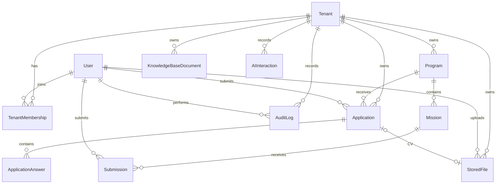

# Data Model

Code version: `v0.8.0`

Baseline commit: `4e2390ce270ef1e049652495885d792a0cbed959`

> `v0.7.3` (Applicant CV & profile links) adds `cvFileId` (unique, optional FK → `StoredFile`,
> `onDelete: SetNull`), `githubUrl` and `linkedinUrl` to `Application`, giving each application one
> optional stored CV and two optional profile links. Schema change — migration
> `20260630120000_application_cv_links`.
>
> `v0.7.0` (Object storage) adds the `StoredFile` model (tenant-scoped file metadata; bytes live in
> MinIO) and the `FileStatus` enum. Schema change — migration `20260629101218_object_storage`.
>
> `v0.8.0` adds `RegressionDataMarker`, an explicit local/dev cleanup boundary for regression-generated
> records.
>
> `v0.6.0` (Programs management) begins managing `Program` records through admin CRUD (incl. the
> `startsAt`/`endsAt` cohort dates) and adds `program.*` `AuditLog` events. No schema change was required.
>
> `v0.5.0` (Applications lifecycle) persists `Application`, `ApplicationAnswer` and the related
> `AuditLog` events for the first time (authenticated apply → review). No schema change was required —
> these entities already existed.
>
> `v0.3.0` (Keycloak IAM) changes the identity model: `User` gains `keycloakSubjectId` (unique link to
> the Keycloak subject), `emailVerified`, `platformRole` and an optional `passwordHash` (Keycloak owns
> credentials). New enum `PlatformRole { SUPER_ADMIN }`. `TenantRole` becomes the org-scoped roles
> `ORG_ADMIN`, `HR`, `TECH_LEAD`, `APPLICANT`. Migration `20260628000000_keycloak_iam_rbac`.

## Entity Relationship Overview

## Core Entities

- `Tenant`: white-label organization using TalentOS.
- `User`: shared identity for applicants, tenant owners and admins.
- `TenantMembership`: user role within a tenant.
- `Program`: tenant-owned learning/recruitment program.
- `Application`: applicant submission to a program; optionally links a CV (`cvFile` → `StoredFile`) and carries optional `githubUrl` / `linkedinUrl`.
- `ApplicationAnswer`: structured answers inside an application.
- `AuditLog`: security and business action history.
- `StoredFile`: tenant-scoped metadata for an object stored in MinIO (bytes live in the object store).
- `RegressionDataMarker`: local/dev marker rows identifying records created by regression workflows and
  safe to remove during regression cleanup.

## Future-Ready Entities

- `Mission`: mission-based learning assignment.
- `Submission`: participant mission deliverable.
- `PortfolioArtifact`: public engineering portfolio item.
- `Certificate`: tenant-issued certificate.
- `KnowledgeBaseDocument`: tenant-owned knowledge content.
- `AIInteraction`: auditable AI mentor/assistant interaction metadata.

## Tenant Isolation Rule

Every tenant-owned table includes `tenantId`. Queries for tenant-owned data must filter by the active tenant, and authorization checks must reject cross-tenant access.
