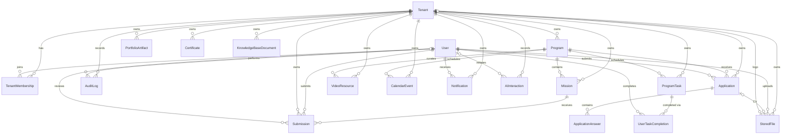

# Data Model

Code version: `v0.16.3`

Baseline commit: `3856f61`

> `v0.16.3` (SSDLC docs refresh, D-071) is a documentation-only baseline — no schema change. It
> realigns this document with the actual schema: the ER diagram is regenerated to cover all models
> and relations (it previously showed 12 of 20), the five `v0.12.0` dashboard models join the Core
> Entities list, and the four future-pillar models are reframed as migrated schema stubs. The
> schema itself has been frozen since the `v0.15.0` migration — `v0.16.0` (dashboard progress +
> program content) was code-only, and `v0.16.1`/`v0.16.2` were docs/tooling patches.
>
> `v0.15.0` (Mission Submission Workflow, D-067) activates the previously scaffolded `Submission`
> model: adds `tenantId` (FK→tenants, Cascade — direct tenant scoping, backfilled from the parent
> mission), `reviewerFeedback` (String?), `reviewedAt` (DateTime?), `reviewerUserId` (FK→users,
> SetNull), a unique `[missionId, applicantId]` (one submission per applicant per mission; the SEM
> revision loop reuses the row) and an index on `[tenantId, status]`. The `User` relation splits into
> named `SubmissionApplicant` / `SubmissionReviewer` relations. Also drops the superseded
> `missions_tenantId_programId_idx`. `SubmissionStatus` transitions used by MVP-1:
> `DRAFT→SUBMITTED→ACCEPTED|NEEDS_REVISION`, `NEEDS_REVISION→SUBMITTED` (`REVIEWED` unused). Audit
> actions: `submission.created`, `submission.updated`, `submission.submitted`, `submission.reviewed`.
> Migration: `20260706090000_v0_15_0_mission_submissions`.
>
> `v0.14.0` (Mission Engine MVP) extends `Mission` from a placeholder into a managed learning
> assignment: `MissionStatus` enum (`DRAFT`, `PUBLISHED`, `ARCHIVED`), `status`, `weekNumber`, `order`,
> `objective`, `acceptanceCriteria`, `deliverables`, `evaluationCriteria`, and `competencyTags`.
> Migration: `20260704160000_v0_14_0_mission_engine_mvp`.
>
> `v0.12.0` (applicant dashboard) adds 4 new models + 1 enum + 1 join table:
> `ProgramTask` (id, tenantId, programId, weekNumber 1-4, title, description?, dueAt?, order, timestamps),
> `VideoResource` (id, tenantId, programId, weekNumber?, title, url, description?, timestamps),
> `Notification` (id, tenantId, userId, type NotificationType, title, body?, readAt?, createdAt),
> `CalendarEvent` (id, tenantId, programId, title, description?, startsAt, endsAt?, location?, timestamps),
> `UserTaskCompletion` (id, taskId, userId, completedAt — unique on [taskId, userId]),
> `NotificationType` enum (INFO, WARNING, SUCCESS, TASK_DUE).
> Relations added to `Tenant` (programTasks, videoResources, notifications, calendarEvents),
> `User` (notifications, taskCompletions), and `Program` (tasks, videoResources, calendarEvents).
> Migration: `20260703150655_v0_12_0_applicant_dashboard`.
>
> `v0.11.4` (UI polish) makes no schema change — it is a UI-only iteration (apply page redesign, admin
> sidebar active-state indicator, review page back button).
>
> `v0.11.1` (reserved slugs) makes no schema change. It also records the schema addition delivered via
> PR #13: a **partial unique index** `applications_applicantId_programId_active_key` on
> `applications (applicantId, programId) WHERE status IN (DRAFT, SUBMITTED, UNDER_REVIEW, ACCEPTED,
> WAITLISTED)` (migration `20260702090000_duplicate_application_active_index`) — REJECTED excluded so
> re-application is allowed; it backstops the app-layer duplicate check.
>
> `v0.11.0` (org-admin auto-provisioning) makes no schema change — it adds a Keycloak service-account
> client and a server-side Admin REST call; the DB org-creation transaction is unchanged.
>
> `v0.10.4` (identity linking & email normalization) and `v0.10.3` (tenant isolation fix) make no schema
> change — both are code-only (email normalization + login-time `keycloakSubjectId` backfill; and
> membership-based authorization consulting existing `TenantMembership` rows).
>
> `v0.10.2` (Keycloak SSO logout fix) makes no schema change — auth/Keycloak configuration only.
>
> `v0.10.1` (Keycloak OTP policy fix) and `v0.10.0` (Super Admin Organizations console) make no
> schema change; `v0.10.0` adds the audit action `organization.created` and reuses `Tenant`, `User`,
> `TenantMembership`, `AuditLog`.
>
> `v0.9.0` (Tenant settings / white-label) adds `Tenant.logoFileId` (unique, optional FK → `StoredFile`,
> `onDelete: SetNull`) linking a tenant to its uploaded logo, plus the audit action
> `tenant.branding_updated`. Schema change — migration `20260701120000_tenant_logo_file_id`.
>
> `v0.7.3` (Applicant CV & profile links) adds `cvFileId` (unique, optional FK → `StoredFile`,
> `onDelete: SetNull`), `githubUrl` and `linkedinUrl` to `Application`, giving each application one
> optional stored CV and two optional profile links. Schema change — migration
> `20260630120000_application_cv_links`.
>
> `v0.7.0` (Object storage) adds the `StoredFile` model (tenant-scoped file metadata; bytes live in
> MinIO) and the `FileStatus` enum. Schema change — migration `20260629101218_object_storage`.
>
> `v0.8.0` adds `RegressionDataMarker`, an explicit local/dev cleanup boundary for regression-generated
> records. Migration: `20260630080000_regression_data_markers`.
>
> `v0.6.0` (Programs management) begins managing `Program` records through admin CRUD (incl. the
> `startsAt`/`endsAt` cohort dates) and adds `program.*` `AuditLog` events. No schema change was required.
>
> `v0.5.0` (Applications lifecycle) persists `Application`, `ApplicationAnswer` and the related
> `AuditLog` events for the first time (authenticated apply → review). No schema change was required —
> these entities already existed.
>
> `v0.3.0` (Keycloak IAM) changes the identity model: `User` gains `keycloakSubjectId` (unique link to
> the Keycloak subject), `emailVerified`, `platformRole` and an optional `passwordHash` (Keycloak owns
> credentials). New enum `PlatformRole { SUPER_ADMIN }`. `TenantRole` becomes the org-scoped roles
> `ORG_ADMIN`, `HR`, `TECH_LEAD`, `APPLICANT`. Migration `20260628000000_keycloak_iam_rbac`.
>
> The base entities (`Tenant`, `User`, `TenantMembership`, `Program`, `Application`,
> `ApplicationAnswer`, `AuditLog`, `Mission`, `Submission`, and the four future-pillar stubs) were
> created by the initial migration `20260627084605_init`.

## Entity Relationship Overview

The diagram covers all schema models and relations. `RegressionDataMarker` is intentionally
omitted — it has no foreign-key relations (it references entities polymorphically by
`entityType`/`entityId`).

## Core Entities

- `Tenant`: white-label organization using TalentOS; optionally links its uploaded logo
  (`logoFile` → `StoredFile`).
- `User`: shared identity for applicants, tenant owners and admins.
- `TenantMembership`: user role within a tenant.
- `Program`: tenant-owned learning/recruitment program.
- `Application`: applicant submission to a program; optionally links a CV (`cvFile` → `StoredFile`) and carries optional `githubUrl` / `linkedinUrl`.
- `ApplicationAnswer`: structured answers inside an application.
- `AuditLog`: security and business action history.
- `Mission`: tenant/program-scoped SEM assignment managed by admins. Published missions are eligible
  to be assigned to accepted applicants.
- `MissionAssignment`: tenant/program/applicant/week assignment row. It gives an accepted applicant
  access to one published mission for a program week, with uniqueness on tenant + program + applicant
  + week.
- `Submission`: participant mission evidence (repository/deployment/Loom URLs + Engineering Journal
  markdown) moving through the SEM review loop; tenant-scoped, one row per applicant per mission,
  reviewed by staff (`reviewerUserId`, `reviewerFeedback`, `reviewedAt`); an `ACCEPTED` submission is
  terminal portfolio/graduation evidence for the mission's `competencyTags`.
- `ProgramTask`: weekly task/assignment (week 1-4) within a program, shown on the applicant
  dashboard; completion tracked per user via `UserTaskCompletion`.
- `VideoResource`: external video resource (YouTube/Loom URL) curated per program and optionally
  per week.
- `CalendarEvent`: scheduled event for a program (dashboard calendar).
- `Notification`: in-app notification for a specific user (`NotificationType`: INFO, WARNING,
  SUCCESS, TASK_DUE) with read tracking (`readAt`).
- `UserTaskCompletion`: join table recording which user completed which `ProgramTask`
  (unique `[taskId, userId]`).
- `StoredFile`: tenant-scoped metadata for an object stored in MinIO (bytes live in the object store).
- `RegressionDataMarker`: local/dev marker rows identifying records created by regression workflows and
  safe to remove during regression cleanup.

## Schema Stubs (migrated, not yet used by application code)

These four models were created by the initial migration and exist as real tables, but **no
application code reads or writes them yet** — they are groundwork for the portfolio, certificates,
knowledge-base and AI roadmap pillars (see `docs/vision.md` Phases 5-8):

- `PortfolioArtifact`: public engineering portfolio item.
- `Certificate`: tenant-issued certificate.
- `KnowledgeBaseDocument`: tenant-owned knowledge content.
- `AIInteraction`: auditable AI mentor/assistant interaction metadata.

## Tenant Isolation Rule

Every tenant-owned table includes `tenantId`. Queries for tenant-owned data must filter by the active tenant, and authorization checks must reject cross-tenant access.
