# Applicant Portal User Guide

Applies to version: `v0.20.7`

Last verified: 2026-08-21

Audience: applicants and accepted program participants.

Required access: Keycloak applicant account with the `APPLICANT` role. Dashboard and mission pages require
an accepted application for the tenant program.

> **Screenshots** live in [`screenshots/`](screenshots/) and were captured against the local demo
> deployment. Regenerate them after seeding the stack (`npm run local:bootstrap`) with
> `npx tsx scripts/user-guide/capture-screenshots.ts` (see [`scripts/user-guide/capture-screenshots.ts`](../../scripts/user-guide/capture-screenshots.ts)).

## Purpose

The Applicant Portal is the participant-facing side of TalentOS. Applicants use it to discover a tenant
program, create an account, submit an application, track application status, and, after acceptance, access
their learning dashboard and missions.

## Related URLs

Local development URLs:

- Applicant Portal: `http://lvh.me:3100`
- Demo Applicant Portal: `http://demo.lvh.me:3100`
- Login: `http://lvh.me:3100/login`
- Apply: `http://demo.lvh.me:3100/apply`
- Application Status: `http://demo.lvh.me:3100/application`
- Accepted Applicant Dashboard: `http://demo.lvh.me:3100/dashboard`
- Missions: `http://demo.lvh.me:3100/dashboard/missions`
- Engineering Journal: `http://demo.lvh.me:3100/dashboard/journal`

Production URL: to be provided by the tenant or platform operator.

## Local Demo Credentials

These credentials are for local development only.

| User | Username | Password | Access |
| --- | --- | --- | --- |
| Applicant | `applicant@demo.talentos.local` | `ChangeMe123!` | Apply and view application status. |
| Accepted Applicant | `accepted@demo.talentos.local` | `ChangeMe123!` | Dashboard, program content, and missions. |

## Account Signup and Login

TalentOS uses Keycloak for identity and access management.

1. Open the Applicant Portal.
2. Select the login action.
3. To create a new applicant account, use the Keycloak registration flow exposed from the portal.
4. Sign in with email and password.
5. If prompted, complete the required password change.

Password policy, password reset and first-login password change are owned by Keycloak. Authenticator-app
2FA is currently **disabled** platform-wide (`v0.14.2`); no OTP setup is requested at sign-in.

Signing in on a tenant subdomain (`http://<tenant>.lvh.me:3100`) determines which organization you are
acting in. You may hold an account under more than one tenant; each subdomain shows only that tenant's
programs and application.

Each tenant has a branded landing page on its own subdomain:

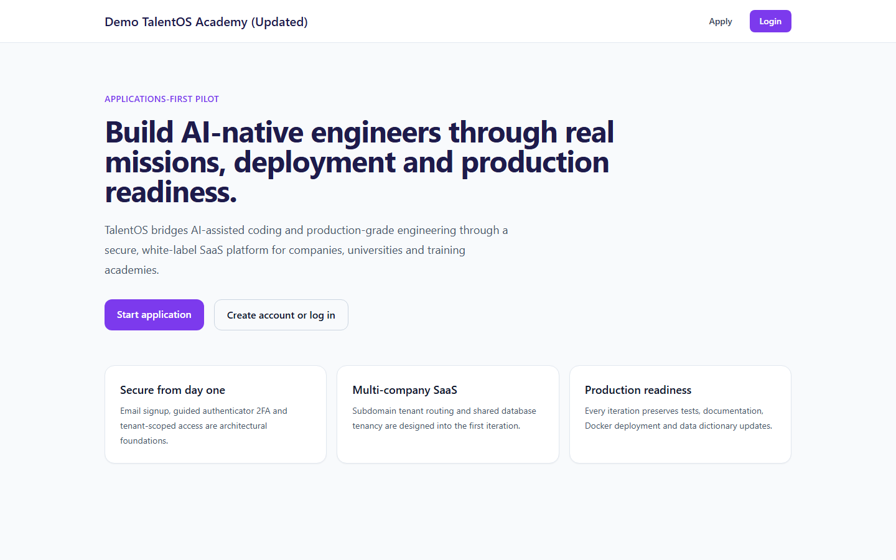

The portal delegates authentication to Keycloak; new applicants use **Create account**:

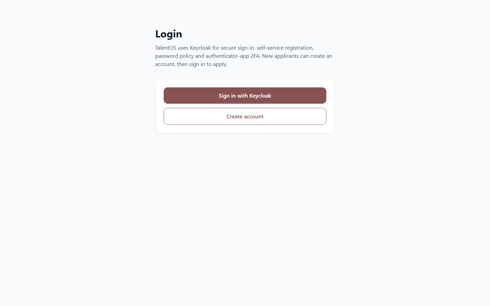

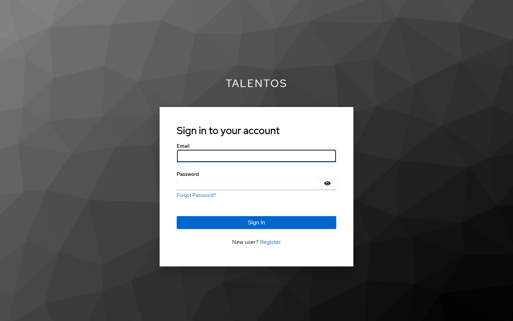

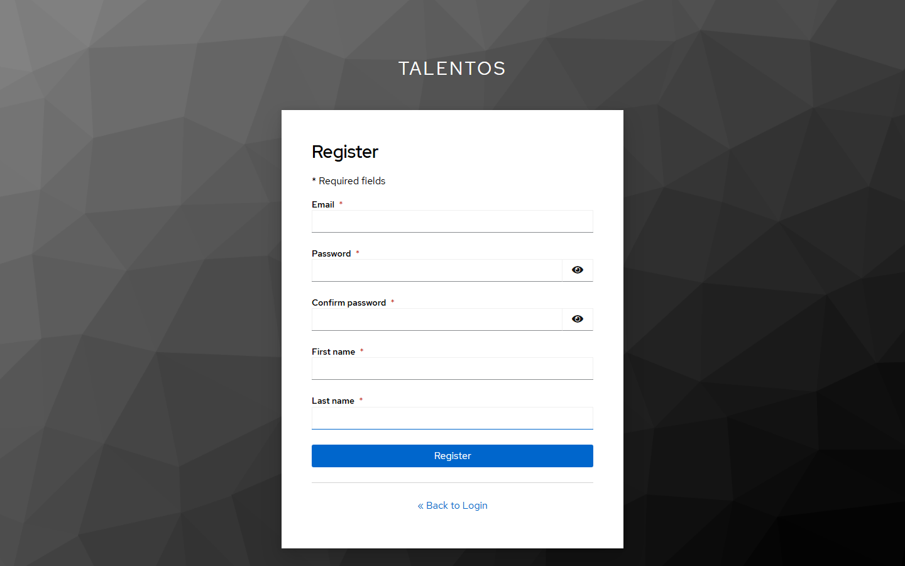

## Apply to a Program

1. Open `http://demo.lvh.me:3100/apply`.
2. Sign in if redirected to login.
3. Optionally, add a profile photo — click the circular avatar next to your name and choose a
   JPG, PNG, or WebP image (2 MB max). This is not required to apply.
4. Select a published program.
5. Enter the motivation/application answer.
6. Upload a CV (PDF, 5 MB max) — drag and drop it onto the Documents section, or click to browse.
7. Add GitHub and LinkedIn profile URLs when available.
8. Submit the application.

After submission, TalentOS records the application as `SUBMITTED`. Duplicate active applications for the
same program are blocked.

If you added a profile photo and later graduate the program, that same photo (along with your GitHub
and LinkedIn URLs) automatically becomes the starting point for your public graduate profile — you
won't need to upload it again, though you can still change it before publishing.

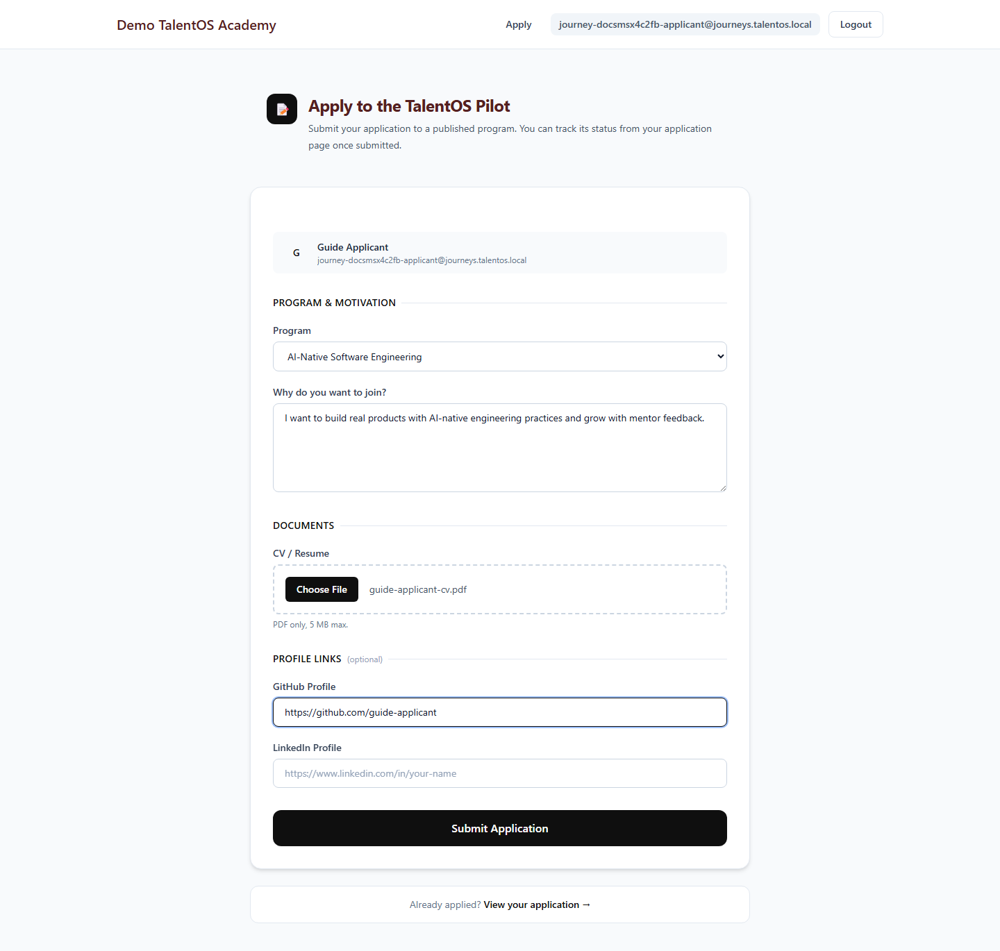

## View Application Status

1. Open `http://demo.lvh.me:3100/application`.
2. Review the current application status.
3. If the status changes after admin review, the page reflects the updated decision.

Common statuses are:

- `SUBMITTED`
- `UNDER_REVIEW`
- `ACCEPTED`
- `REJECTED`
- `WAITLISTED`

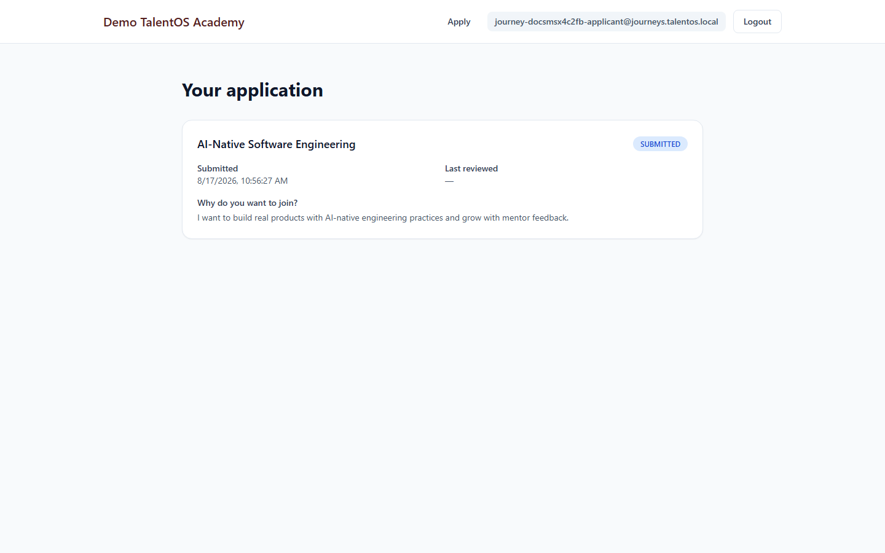

## Accepted Applicant Dashboard

Accepted applicants can open `http://demo.lvh.me:3100/dashboard`.

The dashboard contains:

- Dashboard overview
- My Program
- Tasks
- Missions
- Journal
- Resources
- Calendar
- Notifications
- Profile

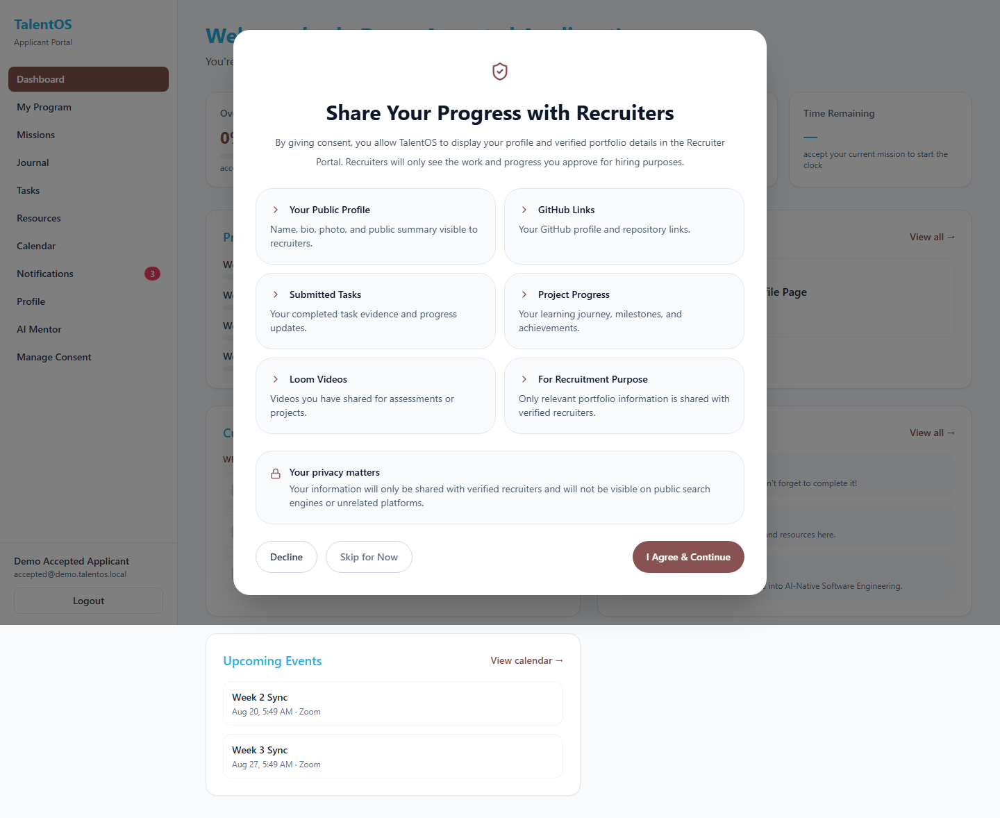

Other dashboard pages — My Program, Calendar, Notifications and Profile:

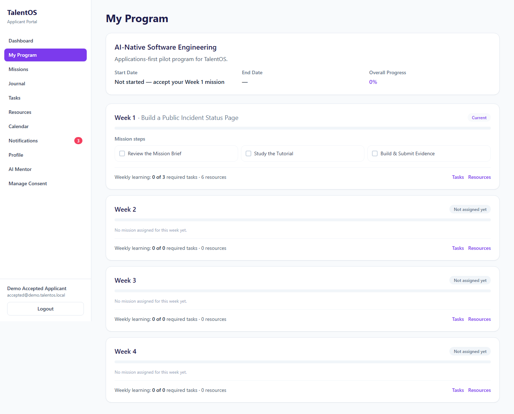

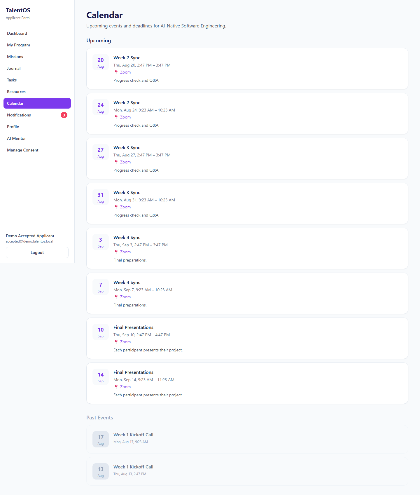

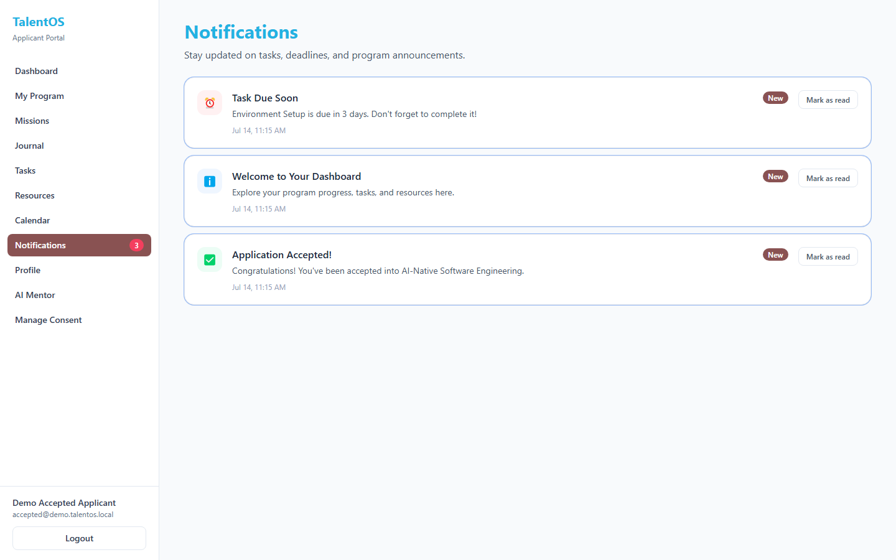

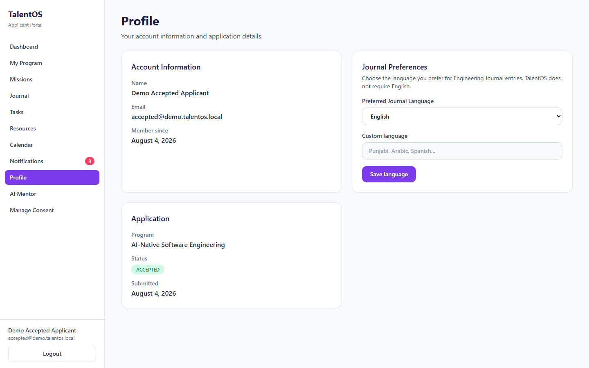

Applicants without an accepted application are redirected back to their application/status flow.

### Your progress is mission-driven (`v0.16.0`)

The overview page's **Overall Progress**, **Missions Accepted** tile and per-week **Program
Progress** bars track your missions: a mission counts toward progress only when a reviewer has
**accepted** your submission. Draft or submitted work does not move the bar yet. The **Current
Mission** card shows the next mission in your program (with your submission status) and links
straight to it; when every mission is accepted, your portfolio evidence is complete. Weekly tasks
remain a separate checklist with their own tile — completing tasks does not change Overall
Progress, but every required task for your assigned week must be complete before you can submit that
week's mission.

To sign out from the dashboard, use the **Logout** button at the bottom of the sidebar (below your
name and email). Signing out ends both the portal session and the Keycloak single sign-on session and
returns you to your tenant's portal home page (`v0.14.3`).

### Access to an organization you have not joined

The Dashboard and Application pages are restricted to members of the tenant whose subdomain you are on. If
you open another tenant's `/dashboard` or `/application` without a membership there, you are redirected to
an **Access denied** page ("You are not a member of this organization") with two options: **Apply to
join** (opens that tenant's apply form) or **Sign out**. Applying is open to anyone signed in — submitting
an application is what enrolls you as an `APPLICANT` in that tenant.

## Weekly Tasks And Resources

Open **Tasks** to see the week from your current assignment, required/optional labels, overall required
task progress, and the items still blocking submission. Select **Mark complete** after finishing a
task. Completion is saved for your account and program week; it remains complete if a reviewer asks
you to repeat that week. Tasks cannot be unchecked in the current MVP.

Each Week 1 task has ordered learning material:

- a Markdown guide displayed safely in the portal;
- a YouTube resource, which opens in a new tab when its final URL is available.

The seeded Week 1 tasks are **Environment Setup**, **Git and GitHub Basics**, and **Introduction to
AI-Assisted Coding**. The first guide is **Introduction to TalentOS**. The introductory video is still
pending, so the portal shows that state instead of linking to a fake video. The **Resources** page also
collects the current program's task-linked material in one read-only view.

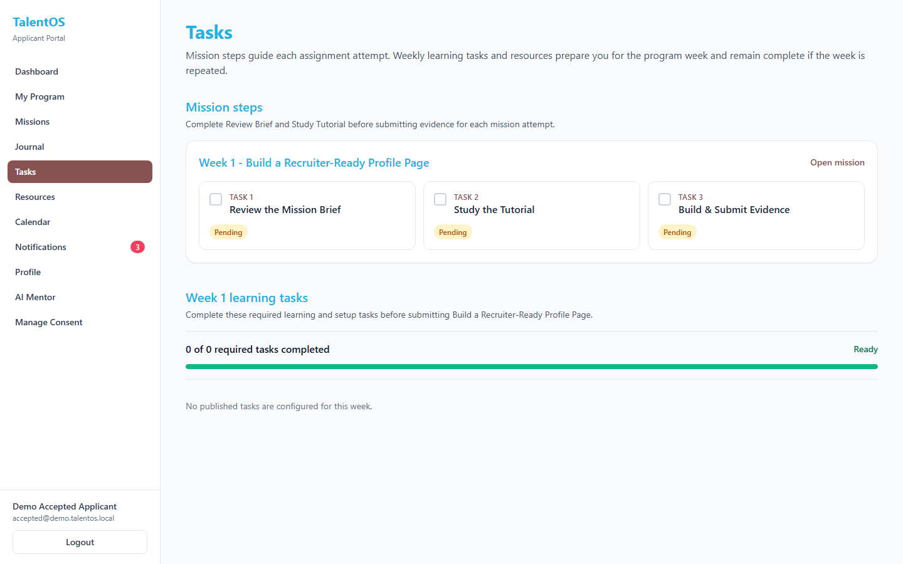

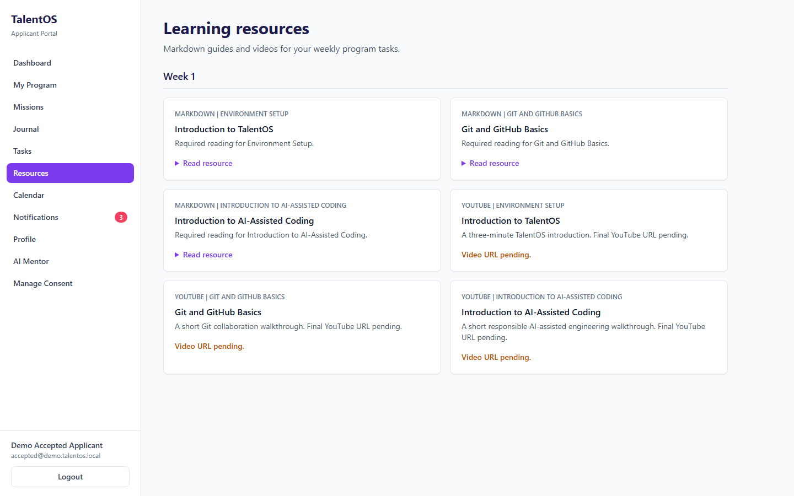

## Missions

Missions are the learning-by-building assignments in TalentOS. As of `v0.18.0`, accepted applicants can
view assigned published missions for their accepted program.

To view missions:

1. Sign in as an accepted applicant.
2. Open the dashboard.
3. Select **Missions** in the sidebar.
4. Open a mission to review the objective, acceptance criteria, deliverables, evaluation criteria, and
   competency tags.

The seeded Week 1 mission is **Build a Public Product Landing Page**.

In `v0.18.0`, Week 1 has multiple seeded variants so interns do not all start with the exact same
assignment. The assigned mission is the one that appears in your dashboard.

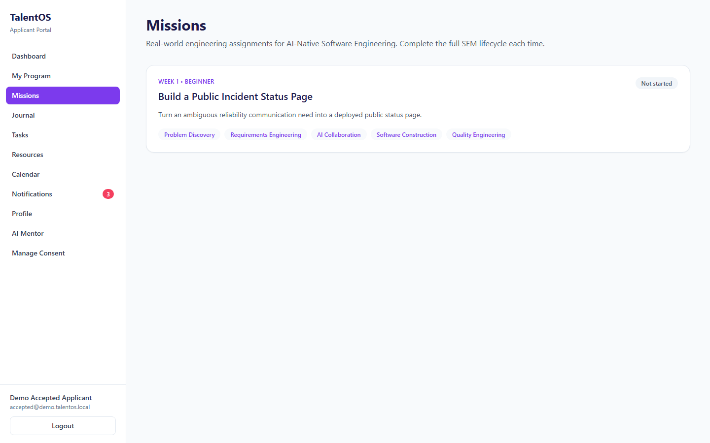

Opening a mission shows the mission workspace — brief, deliverables, the mission steps and the
submission panel:

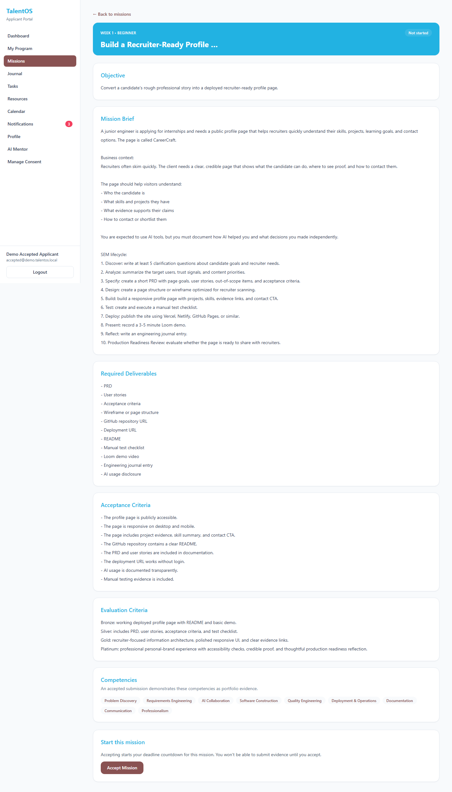

| Week | Mission | Difficulty |
| --- | --- | --- |
| 1 | One seeded Week 1 variant assigned to you | Beginner |
| 2 | Design and Build the TaskPilot Application | Intermediate |
| 3 | Containerize, Automate and Load-Test TaskPilot | Advanced |
| 4 | Take TaskPilot to Production | Expert |

### Mission acceptance, tasks, submission, and review

Open an assigned mission and select **Accept Mission** to start its deadline and grace-period clock.
Accepting is also what makes the mission "started" — journal entries cannot be dated before that day.

The workspace is a set of tabs: **Overview**, the mission's fixed steps (review the brief, study the
tutorial), one tab per learning task authored for **this mission**, and finally submission. Learning
tasks unlock in order, and a task marked as a prerequisite blocks the mission's own steps until it is
complete.

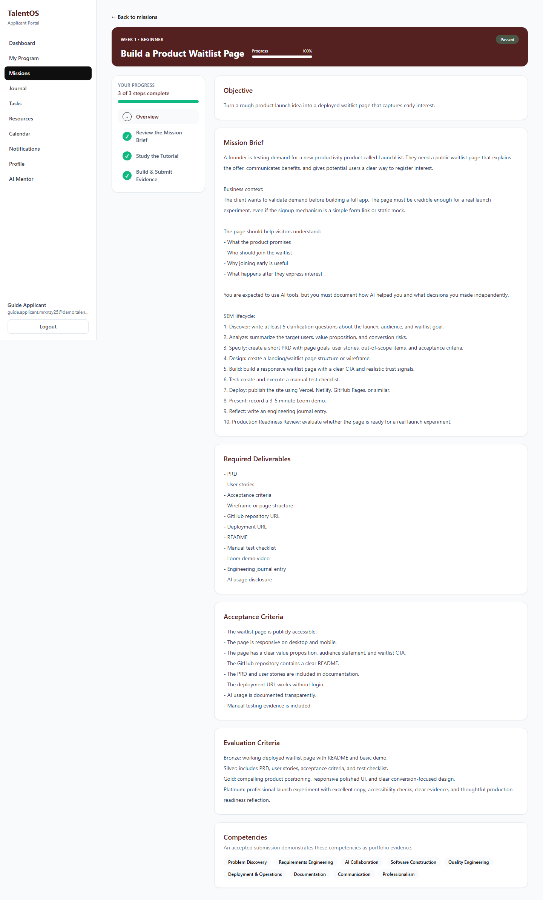

Since `v0.20.0`, learning tasks belong to a **specific mission** rather than to the week in general, so
you only ever see the tasks authored for the mission you were actually assigned.

- **Git repository URL** — must be on `github.com`; your PRD, README, user stories and acceptance
  criteria live in the repository.
- **Deployed application URL(s)** — one or more reachable public `http(s)` links. Keep one input and
  separate multiple links with a semicolon, for example
  `https://app.example.com; https://api.example.com` (maximum ten).
- **Loom walkthrough URL** — must be a supported public `loom.com` share/watch link.

1. Fill in your evidence and select **Save draft** as often as you like.
2. Use the submission checklist to confirm mission steps and required week tasks are complete, at least
   four journal entries belong to this assignment attempt, and every required evidence group is present.
3. Select **Submit for review**. TalentOS checks the GitHub repository, every deployed application URL,
   and Loom page independently for public reachability. Internal/private destinations are rejected;
   one failed deployment URL blocks the whole submission and identifies that URL.
4. If any check fails, the submission stays a draft (or revision), journals stay unchanged, and the
   page shows an actionable error. Successful submission timestamps the submission, updates the
   deadline-aware assignment status, and locks only the journals for this attempt.
5. A reviewer can accept, request changes, or require a same-week repeat. Feedback appears on the
   mission page and the applicant receives a notification.
6. A revision reuses the same attempt and reruns readiness and URL checks. A **repeat** creates a
   fresh attempt on a *different* mission for the same week — never the one you just failed. Because
   tasks belong to a mission (`v0.20.0`), the new mission brings its own learning tasks to complete;
   your completions on the earlier mission are kept, not erased. Mission steps and the minimum four
   attempt-linked journal entries must be done again for the new attempt.
7. If no unused mission exists for that week, you will see that you are waiting for one. Your program
   team is notified automatically, and the new mission is assigned the moment they publish it —
   nothing is required from you.
8. An accepted submission is final and becomes portfolio evidence for the mission's competencies.

## AI Mentor

The AI Mentor is a conversational assistant available to accepted applicants at
`http://demo.lvh.me:3100/dashboard/mentor`.

### What the AI Mentor does

The mentor answers questions about your program, tasks, missions, software engineering practices (SDLC,
SEM, mission framework), and general career guidance. It uses a rule-based classifier to stay on-topic
and a knowledge base drawn from platform documentation.

### Using the AI Mentor

1. Sign in as an accepted applicant.
2. Open the dashboard.
3. Select **AI Mentor** in the sidebar.
4. Type a question in the chat input and press **Enter** or click **Send**.
5. The mentor's response appears as a formatted message with Markdown rendering and syntax-highlighted
   code blocks.
6. Use the **suggested questions** chips above the input for quick prompts.

### Conversation management

- **New Chat**: Click the **New Chat** button to start a fresh conversation.
- **Conversation history**: Previous conversations are listed in the sidebar. Click any to resume.
- **Persistence**: Conversations are saved to your browser's local storage and to the database, so they
  persist across sessions.
- **Loading indicator**: Each conversation shows its own loading spinner while the mentor is thinking.
  A "Still working..." message appears if the response takes more than a few seconds.

### Rich cards

The mentor can render rich cards inside responses, including task cards, progress indicators, timelines,
tips, badges, and warnings.

### Response caching

The mentor caches LLM responses to avoid redundant API calls and reduce latency:

- **Dynamic questions** (about your tasks, progress, timeline) are cached per user and per context — if
  your program state hasn't changed, asking the same question again returns the cached response
  instantly.
- **Static knowledge questions** (e.g., "Explain SDLC") are cached across all users, so common
  questions are fast for everyone.
- Cached responses expire after 5 minutes. If you complete a task or your context changes, the cache
  is automatically invalidated for dynamic questions.

Daily reflection is recorded only through the dedicated Engineering Journal. The legacy inline
mission-submission journal is no longer shown in applicant or admin interfaces.

## Engineering Journal (`v0.17.0`, grouped in `v0.20.0`)

The dedicated **Journal** dashboard page stores daily structured reflections. Entries are linked to
your tenant, user account, accepted program, selected published mission and the mission's week number.

### Step 1 — Browse your journal by mission

Open **Journal** in the sidebar. Entries are grouped into one collapsible section per mission, newest
first, with only your current mission expanded. Each section header shows the week, the mission title
and how many entries it holds; a **Locked** badge means that mission's attempt has been submitted.

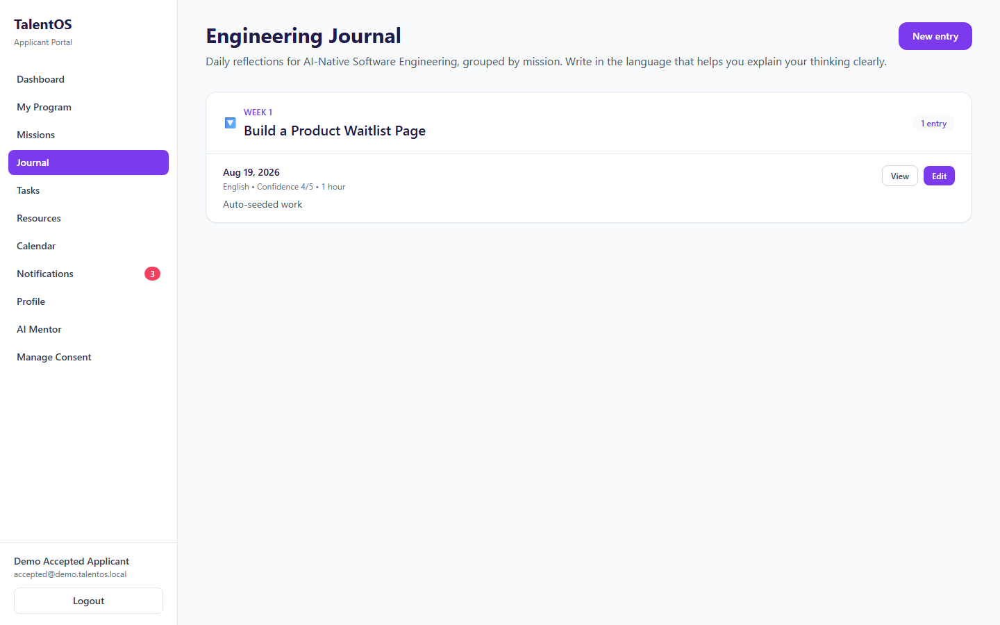

A repeated week appears **twice** — once per mission — so the reflections you wrote for the first
attempt stay separate from the retry. Where a week has more than one attempt, the header adds an
**Attempt N** label.

Expand a section to list its entries. Each row shows the date, language, confidence and time logged,
with **View** and **Edit** actions. Entries whose attempt has been submitted show **Locked** in place
of Edit.

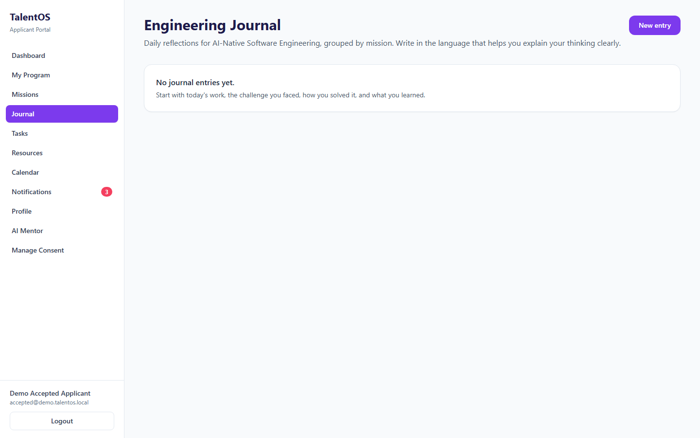

### Step 2 — Read an entry

**View** opens the entry read-only. If it is still editable, an **Edit** button switches the same page
into the form; if it has been locked by a submission, the page shows "Locked after submission" instead.

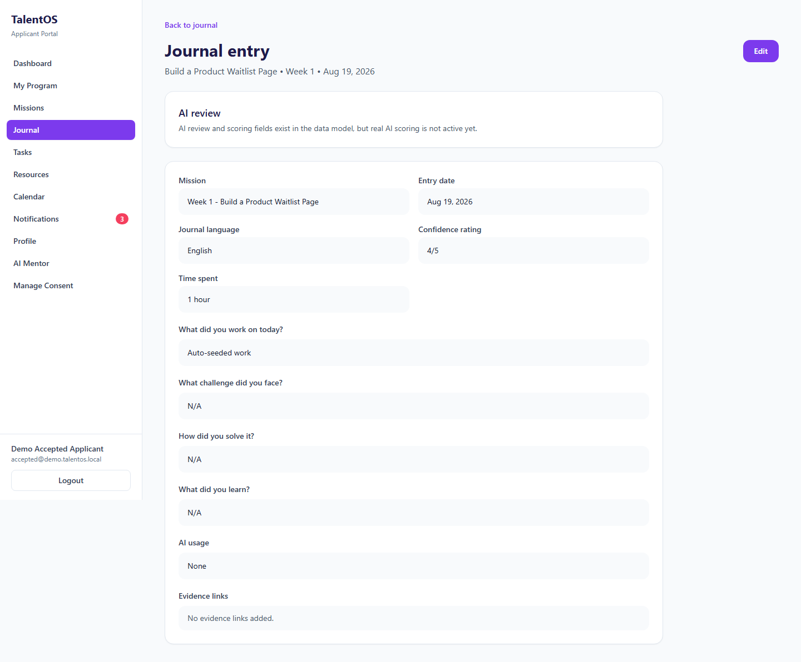

### Step 3 — Write a new entry

**New entry** opens the form. The entry date is bounded at both ends:

- **Not before the mission started.** A journal entry records work done *on* a mission, so it cannot
  pre-date the day you accepted that mission (`v0.20.0`). The date picker enforces this and the hint
  names the earliest valid day; the server rejects it too, so editing the page cannot bypass it.
- **Not in the future.** Today and earlier only, judged in your browser's time zone.

One entry per date. If you already wrote an entry for a date, edit that entry instead — the form links
you straight to it.

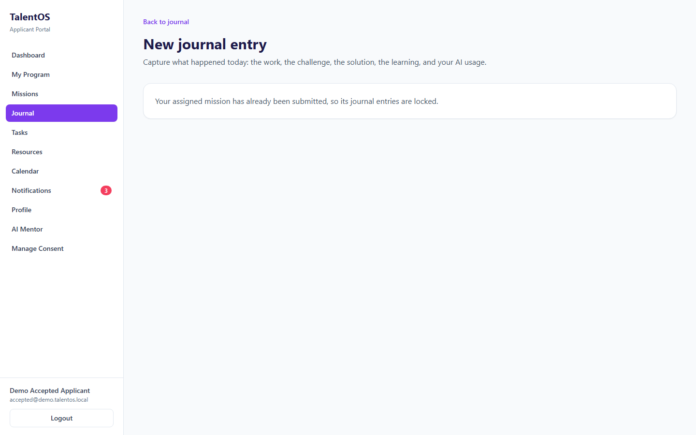

Each journal entry asks for:

- What you worked on today
- What challenge you faced
- How you solved it
- What you learned
- How you used AI, or that no AI was used
- Confidence rating from 1 to 5, with an accessible explanation from "I need significant help" to
  "I could explain this to someone else"
- Time spent in hours
- Evidence links such as GitHub, PR, deployed URL or video links

You may write in English, Roman Urdu, Roman Hindi or another language. Use **Profile** to set your
Preferred Journal Language; new journal entries use that preference by default. TalentOS does not
translate or process languages automatically yet.

The mission submission checklist counts only journal entries linked to the exact current assignment
attempt and dated today or earlier. Previous attempts, another applicant/tenant, unlinked legacy rows,
and future dates do not count toward the minimum of four. `entryDate` is the date you selected;
submission time is recorded separately after all submission checks pass.

AI scoring columns exist in the database for future mentor/reviewer workflows, but real AI scoring is
not active in this version.

## Recruiter Visibility Consent (`v0.20.3`)

Once you have four accepted, rated mission submissions in one program, you become eligible for a
public graduate profile that verified recruiters can request access to. A consent modal ("Share Your
Progress with Recruiters") offers three choices:

- **I Agree & Continue** — publishes your profile (name, bio, GitHub links, submitted evidence,
  ratings) to the public graduate directory once your training completes.
- **Decline** — your profile stays private; you can return anytime to reconsider.
- **Skip for Now** — records that you have not decided yet; you can return anytime.

You can review or change your decision anytime from **Manage Consent** in the sidebar. Note: fixed in
`v0.20.3` (D-103) — declining or skipping before you had ever acknowledged consent previously appeared
to work but silently failed to save; the modal reappeared on your next visit as if nothing had
happened. Both choices now persist correctly the first time.

## Troubleshooting

| Issue | Likely Cause | Action |
| --- | --- | --- |
| Cannot sign in | Wrong tenant URL, wrong credentials, or stale Keycloak session | Use the correct tenant URL and sign out/in again. |
| Asked to change password | First-login security requirement | Complete the Keycloak password update. |
| "Access denied — not a member of this organization" | You opened a tenant subdomain where you have no membership | Use your own tenant's URL, or select **Apply to join** to apply to that organization. |
| Dashboard is not visible | Application is not accepted | Check application status first. |
| No missions are visible | No assigned published mission for your accepted program | Contact the program administrator. |
| Apply form does not show a program | No published program exists for the tenant | Contact the program administrator. |

## Known Limitations

- Real AI journal scoring and weekly AI summaries are not implemented yet.
- Evidence file attachments are not supported yet; journal and mission evidence use URL links.
- Portfolio publishing (see Recruiter Visibility Consent above) shipped via a separate merge (PR #62)
  that did not update this guide beyond the consent section `v0.20.3` added — the rest of the public
  graduate directory and recruiter-facing experience is not yet documented here. See
  `docs/Regression_Scenarios.md` Known Gaps.
