# Back Office User Guide

Applies to version: `v0.19.5`

Last verified: 2026-07-19

Audience: platform super admins, organization admins, HR reviewers, and tech leads.

Required access: Keycloak account with a Back Office role and matching tenant membership where applicable.

> **Screenshots** live in [`screenshots/`](screenshots/) and were captured against the local demo
> deployment. Regenerate them after seeding the stack (`npm run local:bootstrap`) with
> `npx tsx scripts/user-guide/capture-screenshots.ts` (see [`scripts/user-guide/capture-screenshots.ts`](../../scripts/user-guide/capture-screenshots.ts)).

## Purpose

The Back Office/Admin Portal is the operating console for TalentOS. It is used to manage organizations,
tenant programs, applicant review, missions, tenant settings, and local development operations.

## Related URLs

Local development URLs:

- Admin Portal: `http://lvh.me:3200`
- Demo Admin Portal: `http://demo.lvh.me:3200`
- Applications: `http://demo.lvh.me:3200/applications`
- Programs: `http://demo.lvh.me:3200/programs`
- Missions: `http://demo.lvh.me:3200/missions`
- Settings: `http://demo.lvh.me:3200/settings`
- Operations: `http://demo.lvh.me:3200/operations`
- Organizations, Super Admin only: `http://lvh.me:3200/organizations`
- Keycloak Admin Console: `http://keycloak.lvh.me:8080`

Production URL: to be provided by the tenant or platform operator.

## Local Demo Credentials

These credentials are for local development only.

| Role / Service | Username | Password | Notes |
| --- | --- | --- | --- |
| Super Admin | `superadmin@talentos.local` | `ChangeMeSuper#1` | Platform-level organization management. |
| Org Admin | `orgadmin@demo.talentos.local` | `ChangeMe123!` | Tenant program, mission, settings, application review, and operations access. |
| HR | `hr@demo.talentos.local` | `ChangeMe123!` | Application review access. |
| Tech Lead | `techlead@demo.talentos.local` | `ChangeMe123!` | Read-only admin access where permitted. |
| Keycloak local admin | `admin` | `admin` | Local IAM administration. |

Super Admin may be forced through a first-login password change depending on the current local Keycloak
state. Authenticator-app TOTP is currently **disabled** platform-wide (`v0.14.2`); newly provisioned org
admins are asked only to set a password on first login, not to configure 2FA.

## Login and Tenant Context

1. Open the Admin Portal.
2. Sign in through Keycloak.
3. Use the tenant-specific hostname for tenant-scoped work, for example `http://demo.lvh.me:3200`.
4. Use the apex host `http://lvh.me:3200` for platform-level Super Admin organization management.

Back Office access requires both:

- a valid Keycloak realm role, and
- a matching TalentOS `TenantMembership` for tenant-scoped actions.

Signing in lands on the Back Office overview — a live snapshot of applications, programs and mission
submissions:

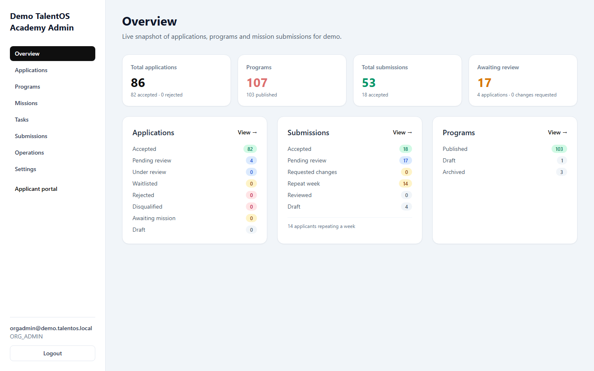

## Role and Capability Matrix

| Capability | SUPER_ADMIN | ORG_ADMIN | HR | TECH_LEAD |
| --- | --- | --- | --- | --- |
| Access Back Office | Yes | Yes | Yes | Yes |
| Create organizations | Yes | No | No | No |
| Manage tenant settings | Yes | Yes | No | No |
| Manage programs | Yes | Yes | No | No |
| Manage missions | Yes | Yes | No | No |
| Review applications | Yes | Yes | Yes | No |
| View missions | Yes | Yes | Yes | Yes |
| Use local Operations page | Yes | Yes | No | No |

## Organizations

Super Admins create new tenant organizations from `http://lvh.me:3200/organizations`.

1. Sign in as `SUPER_ADMIN`.
2. Open **Organizations**.
3. Enter organization name, tenant slug, brand colors, and first Org Admin email.
4. Create the organization.
5. Share the generated first-login credential with the new Org Admin through a secure channel.

Tenant slugs become local subdomains, for example `{slug}.lvh.me`.

## Applications Review

1. Open **Applications**.
2. Select an applicant submission.
3. Review motivation, profile links, and CV/download links when provided.
4. Change the status to the appropriate review outcome.

Supported review outcomes include accepted, rejected, waitlisted, and under review. Status changes are
audited. The queue supports search, status/program filters and pagination.

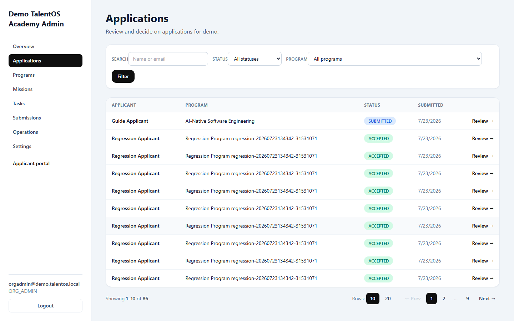

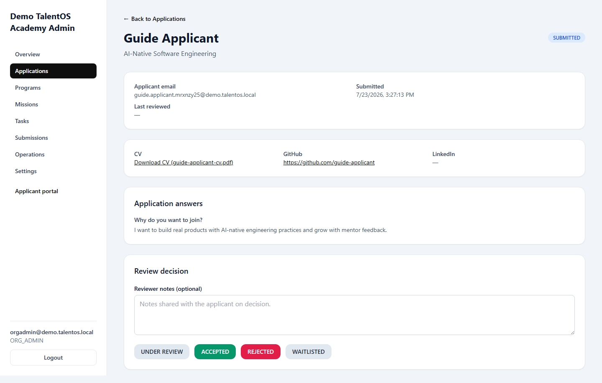

## Programs

Organization Admins and Super Admins manage programs.

1. Open **Programs**.
2. Create a draft program.
3. Edit program details.
4. Publish the program when ready for applicants.
5. Archive programs that should no longer appear in the applicant apply flow.

Only published programs are visible to applicants.

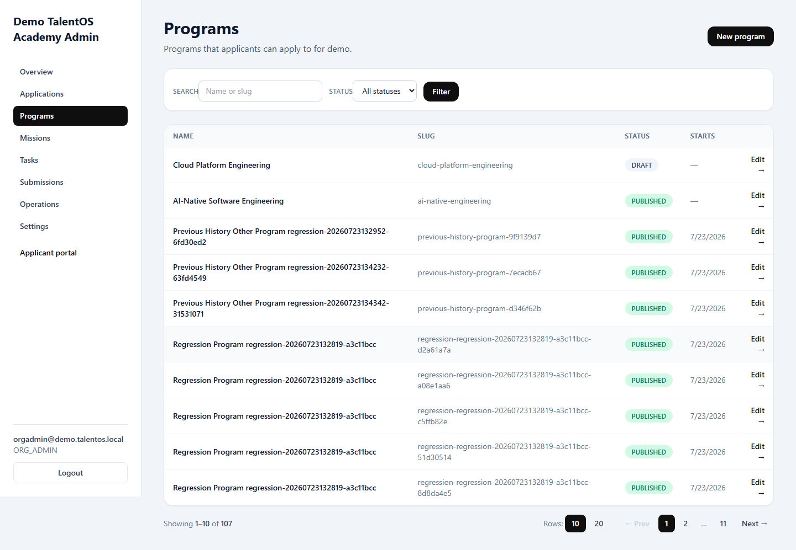

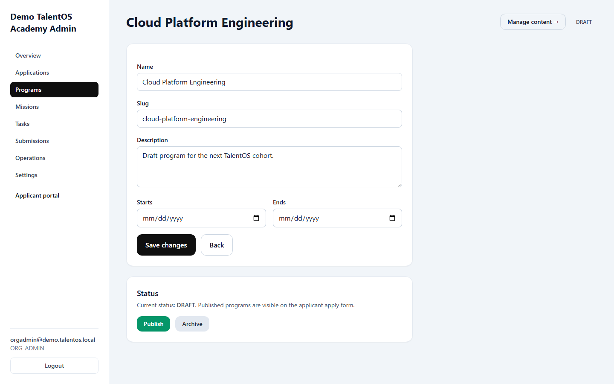

### Program content (`v0.16.0`)

Organization Admins and Super Admins manage the applicant dashboard's curriculum content per
program from **Programs → [program] → Manage content** (`/programs/[id]/content`):

- **Learning resources** — associate a resource with a weekly task, choose **Markdown** or
  **YouTube**, and set title, description, order, and optional duration. Markdown content is stored
  directly; YouTube URLs must be public YouTube links and may remain blank while production is pending.
- **Weekly tasks** — title, description, program week, order, optional due date, required state, and
  published state. Published tasks appear on the applicant Tasks page. Required tasks block mission
  submission for that program week until the applicant marks them complete.
- **Calendar events** — title, description, start/end time, location. Shown on the applicant
  Calendar page.

Each entry can be edited inline or deleted. All changes are audited. HR and Tech Lead see a
read-only notice on this page. The page also flags published required tasks that are missing either a
Markdown or YouTube resource.

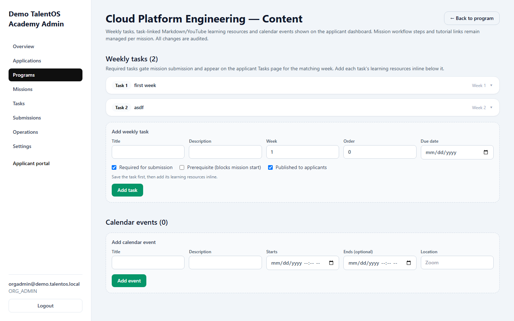

The demo seed configures three ordered required Week 1 tasks: **Environment Setup**, **Git and GitHub
Basics**, and **Introduction to AI-Assisted Coding**. Each has Markdown content and a YouTube resource
record. The final introductory YouTube video is not supplied yet, so its URL is intentionally pending;
the repository includes a short production outline and does not seed a fake link.

### Tasks (`v0.20.0`)

The top-level **Tasks** sidebar page manages weekly learning tasks and their resources for a chosen
program without opening the full Program Content page. Search or pick a program, then add or edit
tasks (each collapses to a `Task N — title` header) and, inline under each task, add multiple learning
resources — Markdown reading, YouTube video, or an uploaded **Document** (PDF/DOC/DOCX/TXT/image).
Required tasks gate mission submission; tasks marked **Prerequisite** must be completed before the
applicant can start the mission's own steps.

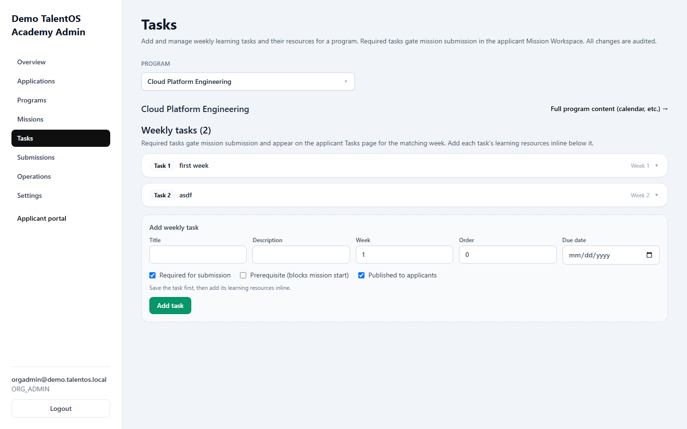

## Missions

Organization Admins and Super Admins manage missions.

1. Open **Missions**.
2. Create a draft mission for a program.
3. Add the mission objective, acceptance criteria, deliverables, evaluation criteria, competency
   tags, tutorial URL, deadline hours, and grace-period hours.
4. Publish the mission when it is ready for accepted applicants.
5. Archive missions that should no longer be visible to applicants.

HR and Tech Lead users can view missions but cannot create, edit, publish, or archive them.

The demo program seeds the full four-week mission arc (`v0.15.1`) — Week 1 **Build a Public Product
Landing Page** (Beginner) through Week 4 **Take TaskPilot to Production** (Expert) — all published
and visible to accepted applicants.

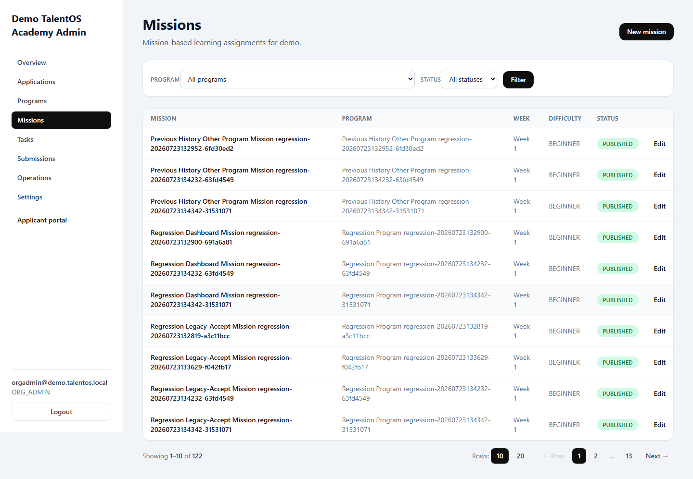

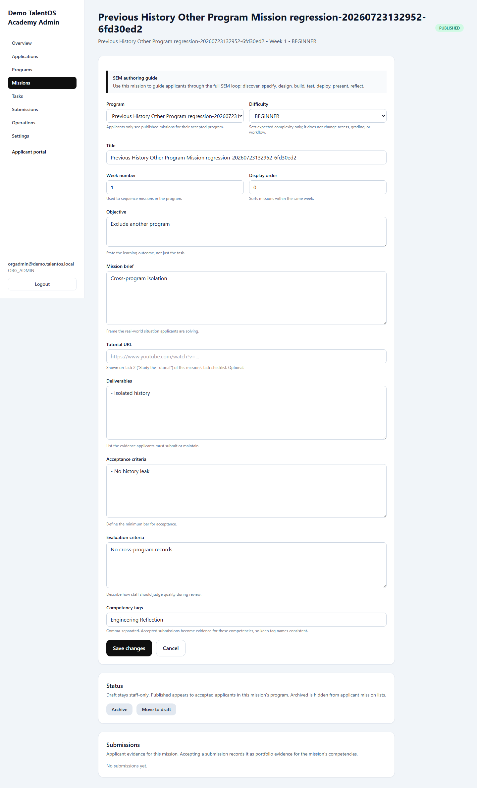

### Reviewing mission submissions (`v0.15.0`)

Each mission detail page lists its applicant submissions (applicant, status, submitted and reviewed
dates). Org Admins, Tech Leads, and Super Admins review them; HR can view but not decide. Applicants
never review each other's work (Graduate Profile: graduates are not code reviewers).

1. Open **Missions** and select the mission.
2. In **Submissions**, select **Review** on a submitted entry.
3. Inspect the evidence: Git repository, each deployed application URL, and Loom walkthrough (every
   link opens separately in a new tab), plus all dedicated **Engineering Journal** entries for that applicant and mission
   assignment attempt. Engineering Journal entries are read-only for reviewers. The legacy
   `Submission.journalMarkdown` field is retained for data compatibility but is not displayed.
4. Either **Accept submission** — final; the submission becomes portfolio evidence for the mission's
   competency tags — **Request changes**, which returns the same attempt for revision, or **Repeat
   week**, which closes the current attempt and creates a fresh assignment attempt. Requesting changes
   or a repeat requires written feedback.
5. The applicant is notified automatically (acceptance or revision request with your feedback), and
   the review is recorded in the audit log.

Before a submission can reach this review screen in **Submitted** state, the server requires every
published required task for the assignment's program week, at least four journals linked to that exact
attempt, and publicly reachable GitHub/every deployment/Loom URL. These checks do not grant reviewers any
new journal write permission; journal context remains read-only.

A submission can be reviewed only while it is in **Submitted** status. A revision reuses the current
attempt. A repeat keeps the old submission and its locked Engineering Journal entries as read-only
history while new entries attach to the new attempt.

The current attempt's journal remains the primary review evidence. When reviewing Attempt 2 or later,
reviewers can optionally expand **Previous Attempt History** to view read-only context from earlier
attempts for the same tenant, program, applicant, and week. Attempts are kept in separate groups, and
each group's journal entries are loaded only through that exact assignment attempt. A previous mission
may differ from the current mission. Unlinked legacy journal records are not guessed into this history,
and the history does not provide edit, delete, or review-decision controls for old attempts.

## Settings

Tenant settings control white-label presentation.

1. Open **Settings** on the tenant Admin Portal.
2. Update tenant name, brand colors, or logo.
3. Save changes.

Branding changes apply to both Applicant and Admin portals for that tenant.

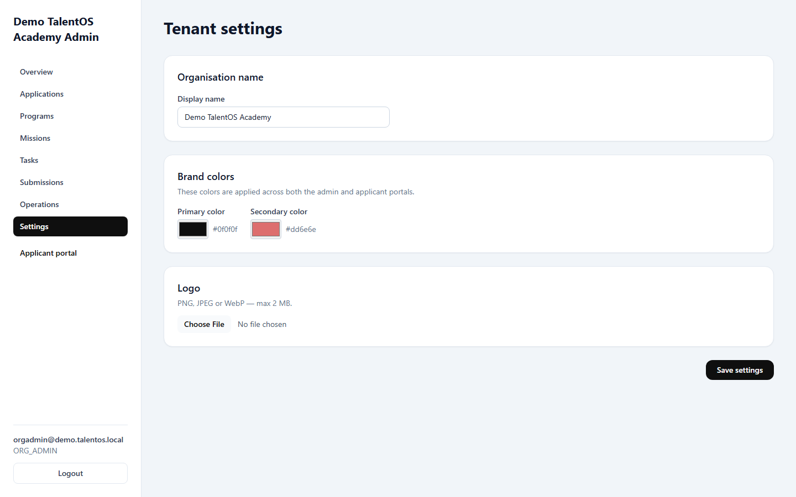

## Operations

The Operations page is a local-development tool. It is not a production operations console.

Use it to:

- view app-visible service health,
- run scenario regression areas,
- inspect pass/fail/skip counts,
- run safe regression cleanup for marker-tagged records,
- view reset guidance for local TalentOS resources.

The Operations page must not be used as evidence that production monitoring exists.

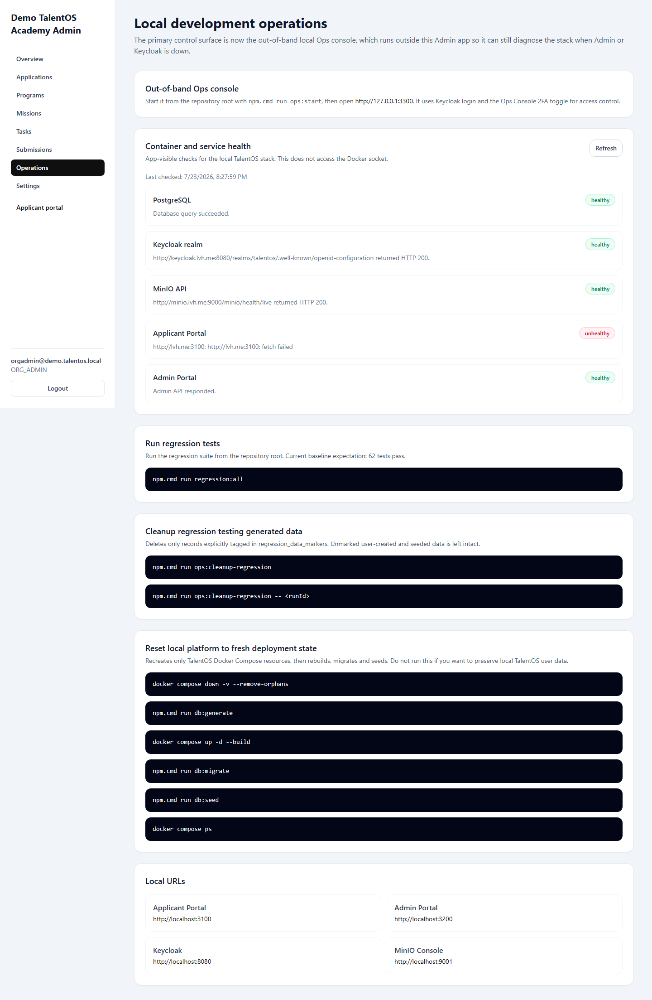

The standalone **Local Ops Console** (`http://127.0.0.1:3300`) provides out-of-band health checks,
regression-suite execution and local reset controls, protected by the same Keycloak session:

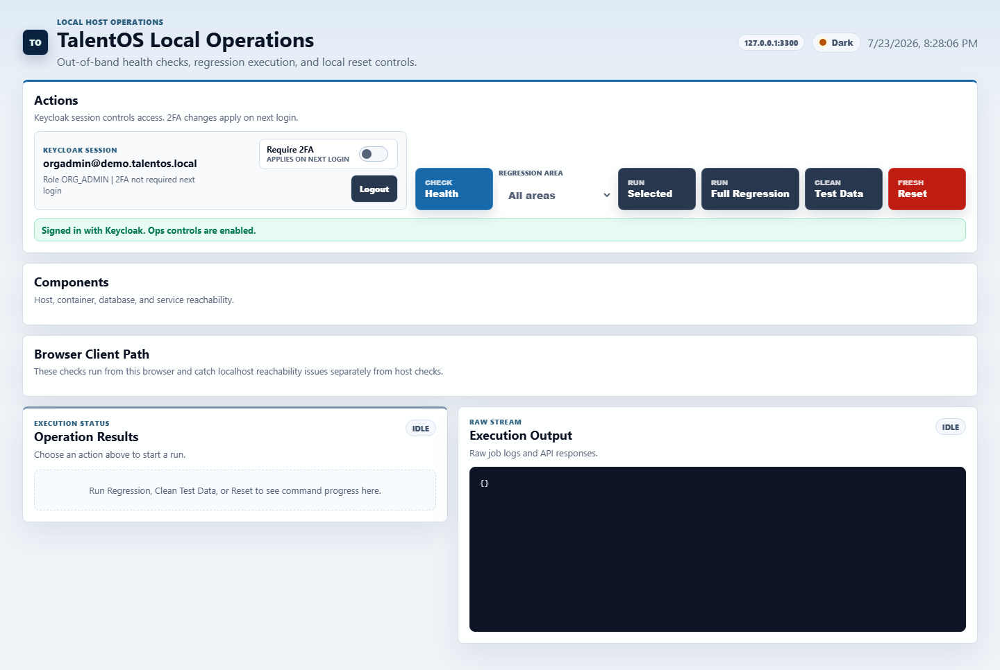

## Known Limitations

- Full Back Office user/role management UI is not complete yet.
- Production deployment operations, backups, alerting, and monitoring are not covered by this guide.
- Public recruiter portfolios, hiring intelligence, and automated Engineering Journal scoring remain
  future workflows.

## Troubleshooting

| Issue | Likely Cause | Action |
| --- | --- | --- |
| Access denied after login | Missing tenant membership or wrong tenant host | Use the correct tenant subdomain and verify membership/role. |
| Organizations link is missing | User is not `SUPER_ADMIN` | Sign in with Super Admin credentials. |
| Cannot edit programs or missions | User lacks `managePrograms` or `manageMissions` | Use `ORG_ADMIN` or `SUPER_ADMIN`. |
| Cannot review applications | User lacks `reviewApplications` | Use `HR`, `ORG_ADMIN`, or `SUPER_ADMIN`. |
| Operations page is unavailable | User is not `SUPER_ADMIN` or `ORG_ADMIN` | Sign in with an allowed role. |
